# Phase E — Multi-Site Establishments & Reconciliation Design

## 1. Context & Business Rules

### 1.1 Policy Directive
ONEFOP declarations are filed **per establishment (site)**. A multi-site organization files one return per physical site. Aggregation across Cameroon must eliminate double counting by design while maintaining full territorial traceability down to the arrondissement level.

### 1.2 Entity Scope
- **Multi-Site Organizations (6 Entity Types)**:
  - `ENTREPRISE` (Private enterprise)
  - `COOPERATIVE` (Cooperative society)
  - `CTD` (Collectivité Territoriale Décentralisée / Municipality)
  - `ONG` (Non-Governmental Organization)
  - `PROJECT_PROGRAM` (Development project or program)
  - `VOCATIONAL_TRAINING` (Vocational training center / CFP)
- **Single-Site Only (Excluded from Multi-Site)**:
  - `ADMINISTRATION` (Ministries, Central Government Directorates, Autonomous Public Bodies).
  - Excluded because civil service employment is managed centrally via MINFOPRA / SIGIPES.
  - Regional delegations and decentralized branches are strictly prohibited from registering separate accounts.
  - Territory for an Administration designates the geographic seat of its headquarters (no restriction to Centre/Mfoundi, enabling public bodies headquartered outside Yaoundé to register).
  - Registration requires a staff-approval check verifying that the registrant is an accredited central public structure.
  - Displayed in Pilotage under a distinct `"Niveau central (Administrations)"` row to prevent distorting regional quotas.

---

## 2. Identifier Architecture & Code Formats

### 2.1 Company Code (Parent)
The existing `Company.establishmentId` (e.g. `EN26000100`, `VT26000114`) is preserved and designated as the **Company Code** (`companyCode`).
- Format: `{Prefix:2}{Year:2}{Serial:4}{SubdivCode:2}` (10 characters).
- Never re-minted or modified when secondary establishments are added.

### 2.2 Site Code (Establishment)
Every site has an explicit `code` derived strictly from the parent Company Code plus a hierarchical sequential suffix:
$$\text{Site Code} = \text{CompanyCode} - \text{Suffix}$$
- **Principal Site (Headquarters)**: Suffix `-01` (e.g. `EN26000100-01`).
- **Secondary Sites**: Suffixes `-02`, `-03`, `-04`, ... allocated sequentially in order of creation (e.g. `EN26000100-02`, `EN26000100-03`).
- **No new national serial**: Sites do not consume national sequential serials; their identity is permanently anchored to the parent entity.

### 2.3 Identifier Tiers & Foreign Key Semantics
> **Resolved 2026-10-02 — see review**: Clarified identifier tiers and explicit FK targets. Today, three models (`Company`, `OnefopSubmission`, `CampaignSubmission`, plus `SubmissionDraft`) use `establishmentId String` to store the 10-character company code (e.g. `EN26000100`). Phase E establishes three distinct identifier tiers:
1. **Company Code (`companyCode`)**: The parent entity's 10-character registration code stored in `Company.establishmentId` (e.g. `EN26000100`).
2. **Site Business Code (`Establishment.code`)**: The human-readable 13-character site identifier (e.g. `EN26000100-01`), printed on attestations, PDF receipts, and SPSS/CSV exports.
3. **Relational Primary Key (`Establishment.id`)**: An internal UUID primary key. All foreign key relations (`OnefopSubmission.establishmentId` and `CampaignSubmission.establishmentId`) target this UUID `Establishment.id`, providing relational integrity via PostgreSQL foreign key constraints.

---

## 3. Data Model & Constraints

### 3.1 Relational Architecture

```mermaid
erDiagram
    User ||--|| Company : "declarant account (1:1)"
    Company ||--o{ Establishment : "has sites (Restrict)"
    Establishment ||--o{ OnefopSubmission : "files returns (Restrict)"
    Establishment ||--o{ CampaignSubmission : "targeted in (Restrict)"
    Region ||--o{ Establishment : "located in"
    Department ||--o{ Establishment : "located in"
    Subdivision ||--o{ Establishment : "located in"
```



> **Resolved 2026-10-02 — see review**: Corrected the ER diagram and declarant access model. In the existing schema (`prisma/schema.prisma:245`), User-to-Company is strictly 1:1 via `Company.userId @unique`. A single corporate declarant manages and submits returns for all secondary sites via a site-selector switcher. Supporting delegated 1:N site-level users would require breaking this unique constraint, overhauling authentication guards, revising registration approval (R.1), and implementing an invitation/permission model; this is explicitly deferred to post-pilot.

### 3.2 Schema Definition (Prisma)

```prisma
enum EstablishmentStatus {
  ACTIVE
  CLOSED
  SUSPENDED
}

model Establishment {
  id              String               @id @default(uuid())
  code            String               @unique // e.g. EN26000100-01 (13 chars)
  name            String               // Site label, e.g. "Usine de Bonabéri"
  isPrincipal     Boolean              @default(false)
  status          EstablishmentStatus  @default(ACTIVE)

  companyId       String
  company         Company              @relation(fields: [companyId], references: [id], onDelete: Restrict)

  // Territory hierarchy (canonical FKs + denormalized text)
  regionId        String
  departmentId    String
  subdivisionId   String
  region          String
  department      String
  subdivision     String
  address         String
  phone           String?
  email           String?

  createdAt       DateTime             @default(now())
  updatedAt       DateTime             @updatedAt

  submissions     OnefopSubmission[]
  campaignTargets CampaignSubmission[]

  @@index([companyId])
  @@index([regionId])
  @@index([departmentId])
  @@index([subdivisionId])
  @@map("establishments")
}
```

#### Related Schema Updates
```prisma
// OnefopSubmission: establishmentId becomes a required FK to Establishment.id (enforced NOT NULL post-backfill)
model OnefopSubmission {
  // ... existing fields ...
  establishmentId       String         // Required FK to Establishment.id (NOT NULL post-backfill)
  establishment         Establishment  @relation(fields: [establishmentId], references: [id], onDelete: Restrict)
  // ...
}

// CampaignSubmission: establishmentId becomes an explicit FK to Establishment.id
model CampaignSubmission {
  id              String           @id @default(uuid())
  campaignId      String
  companyId       String?          // Informational reference to parent
  establishmentId String           // Required FK to Establishment.id
  status          SubmissionStatus @default(PENDING)
  submittedAt     DateTime?
  createdAt       DateTime         @default(now())
  updatedAt       DateTime         @updatedAt

  campaign        DataCampaign     @relation(fields: [campaignId], references: [id], onDelete: Cascade)
  company         Company?         @relation(fields: [companyId], references: [id], onDelete: Restrict)
  establishment   Establishment    @relation(fields: [establishmentId], references: [id], onDelete: Restrict)

  @@unique([campaignId, establishmentId]) // Sole unique constraint
  @@index([campaignId])
  @@index([companyId])
  @@index([establishmentId])
  @@map("campaign_submissions")
}

// SubmissionDraft: establishmentId holds the 13-character site code string (e.g. EN26000100-01),
// unlike OnefopSubmission.establishmentId which holds a UUID FK. This divergence exists because
// drafts are lightweight client-side autosaves keyed before relational establishment resolution.
// Recommended: rename column to siteCode in a future cleanup migration to prevent semantic confusion.
model SubmissionDraft {
  id              String           @id @default(uuid())
  establishmentId String           // 13-char site code (e.g. EN26000100-01); recommended rename: siteCode
  quarterCode     String
  entityType      OnefopEntityType
  draftData       Json
  lastSavedAt     DateTime         @default(now())
  savedByUserId   String?
  // ...
  @@unique([establishmentId, quarterCode])
  @@index([establishmentId])
  @@map("submission_drafts")
}
```

### 3.3 Integrity & Deletion Invariants
1. **`onDelete: Restrict` Everywhere**:
   - `Company` $\rightarrow$ `Establishment`: A company cannot be deleted if establishments exist.
   - `Establishment` $\rightarrow$ `OnefopSubmission`: An establishment cannot be deleted if historical returns exist.
   - `Establishment` $\rightarrow$ `CampaignSubmission`: An establishment cannot be deleted if campaign targets exist.
2. **Never Deleted, Closed via Status**:
   - Physical sites that cease operations are updated to `status = CLOSED` with a closure date. Historical returns remain immutable.
3. **Partial Unique Index on Principal Site**:
   - Exactly one principal site per company is enforced at the database level via raw SQL partial unique index:
     ```sql
     CREATE UNIQUE INDEX "establishments_company_principal_uidx"
       ON "establishments" ("companyId")
       WHERE "isPrincipal" = true;
     ```
4. **Submission Unique Return Index**:
   - The unique return index moves from `(companyId, quarterCode)` to `(establishmentId, quarterCode)`:
     ```sql
     CREATE UNIQUE INDEX "onefop_submissions_establishment_quarter_live_uidx"
       ON "onefop_submissions" ("establishmentId", "quarterCode")
       WHERE "status" IN ('PENDING_REVIEW', 'APPROVED');
     ```
5. **Campaign Submission Constraint & Review Sync**:
   > **Resolved 2026-10-02 — see review**: Dropped `@@unique([campaignId, companyId])` on `CampaignSubmission` in favor of `@@unique([campaignId, establishmentId])` (foreign key to `Establishment.id`). In existing code (`prisma/schema.prisma:587-588`), `CampaignSubmission` enforces `@@unique([campaignId, companyId])`, which prevents multi-site companies from having more than one target card in a campaign. The migration drops this constraint. In addition, `src/questionnaires/campaign-review-sync.ts:33` is updated from querying `{ campaignId, companyId }` to querying `{ campaignId, establishmentId }`, preventing review actions on one branch from erroneously altering sibling site target statuses.

---

## 4. Reconciliation Engine

### 4.1 Concept per Entity Type

| Entity Type | Local Return Metric | Principal Return Control Question (Non-Aggregated) |
|---|---|---|
| **ENTREPRISE** | `S1Q10` (`permanentWorkers`) | `CTRL_TOTAL_PERMANENT` ("Effectif permanent total de l'entreprise, tous sites confondus") |
| **COOPERATIVE** | `COOP_S1Q11` (`permanentWorkers`) | `CTRL_TOTAL_PERMANENT` ("Effectif permanent total de la coopérative, tous sites confondus") |
| **CTD** | `CTD_S1Q09` (`permanentWorkers`) | `CTRL_TOTAL_PERMANENT` ("Effectif permanent total de la CTD, tous sites confondus") |
| **ONG** | `ONG_S1Q10` (`permanentWorkers`) | `CTRL_TOTAL_PERMANENT` ("Effectif permanent total de l'ONG, tous sites confondus") |
| **PROJECT_PROGRAM** | `PP_S1Q15` (`permanentWorkers`) | `CTRL_TOTAL_PERMANENT` ("Effectif permanent total du projet/programme, tous sites confondus") |
| **VOCATIONAL_TRAINING** | `VT8_5_PERM_M` + `VT8_5_PERM_F` (Permanent trainers) | `CTRL_VT_PERM_TRAINERS` ("Effectif permanent total des formateurs, tous sites confondus") |
| **ADMINISTRATION** | Excluded | Excluded (Single-site, central MINFOPRA data) |

### 4.2 Reconciliation Rules & Anomaly Binding
For a company with active establishments $E_1, \dots, E_n$ (where $E_1$ is principal):

$$\text{ReportedSum} = \sum_{i=1}^n \text{Metric}(E_i)$$
$$\text{ControlTarget} = \text{ControlQuestion}(E_1)$$

> **Resolved 2026-10-02 — see review**: Resolved contradiction between proposed headless JSON anomaly payloads and the existing `OnefopAnomaly` schema (`prisma/schema.prisma:2325-2350`), which requires a non-nullable `submissionId String` foreign key and scalar string columns (`observedValue`, `expectedValue`, `deltaValue`), without any JSON metadata field.
>
> Two options were evaluated:
> - *(a) Schema Evolution*: Make `submissionId` nullable and add a `metadata Json?` column. *Tradeoff*: Requires altering a core audit table and complicates existing reviewer queries that assume every anomaly links to a specific submission dossier.
> - *(b) Schema-Conformant Fit (Selected)*: Anchor reconciliation anomalies directly to the principal site's submission dossier ($E_1$), mapping discrepancy metrics into the existing scalar string columns.
>
> Under the selected schema-conformant approach:

1. **Trigger Condition**:
   - Re-evaluated automatically whenever all active establishments of the company have filed a live return (`PENDING_REVIEW` or `APPROVED`) for that quarter, and the principal site return exists.
2. **Discrepancy Anomaly**:
   - Configurable tolerance threshold $\tau$ (default: $0.05$ or $5\%$):
     $$\frac{|\text{ReportedSum} - \text{ControlTarget}|}{\text{ControlTarget}} > \tau$$
   - If discrepancy exceeds tolerance, log anomaly in `OnefopAnomaly` bound to the principal site's return:
     - `submissionId`: $E_1\text{.submissionId}$ (Principal site submission)
     - `ruleCode`: `"RECONCILIATION_HEADCOUNT_DISCREPANCY"`
     - `ruleFamily`: `"COHERENCE_MULTISITE"`
     - `severity`: `ERROR`
     - `isBlocking`: `false` (Non-blocking warning for reviewers, or blocking review approval based on policy)
     - `observedValue`: `String(ReportedSum)`
     - `expectedValue`: `String(ControlTarget)`
     - `deltaValue`: `String(ReportedSum - ControlTarget)`
     - `description`: `"Écart de réconciliation: total déclaré sur les sites (" + ReportedSum + ") différent du contrôle siège (" + ControlTarget + ")"`
   - *String-Cast Limitation*: Casting numeric counts to strings (`observedValue = String(ReportedSum)`, etc.) is an accepted structural limitation of Option B to fit the current scalar schema without migrations; this should be revisited if Option A (structured `metadata Json?`) is adopted in a later refactor.
3. **Missing Return Anomaly**:
   - If the campaign deadline passes and only a subset of active secondary sites have filed:
   - Logged against the principal site's return ($E_1$):
     - `submissionId`: $E_1\text{.submissionId}$
     - `ruleCode`: `"MISSING_ESTABLISHMENT_RETURNS"`
     - `ruleFamily`: `"COMPLETENESS_MULTISITE"`
     - `severity`: `WARNING`
     - `observedValue`: `"<N> sites déposés"`
     - `expectedValue`: `"<Total> sites attendus"`
     - `deltaValue`: `"<M> manquants"`
     - `description`: `"Dossiers de sites manquants: " + missingSiteNames.join(', ')`
   - *Deliberate Gap Choice*: If the principal site itself has not filed by the deadline, no reconciliation anomaly is created even when secondary sites are missing; delinquency is tracked strictly as campaign non-response elsewhere in pilotage rather than creating orphaned anomalies. This is an explicit design choice.
4. **Zero Double-Counting Invariant**:
   - Regional and national statistical reporting, aggregations, and indicators sum **only the local returns** ($\text{ReportedSum}$). The control question is an evaluation baseline and is **never** added to totals.

---

## 5. Campaign Targeting & Mid-Campaign Sites

### 5.1 CampaignSubmission Evolution & Review Synchronization
> **Resolved 2026-10-02 — see review**: In the existing schema, `CampaignSubmission` enforces `@@unique([campaignId, companyId])`. In a multi-site system where multiple establishments share the same `companyId`, this constraint triggers unique violations upon inserting secondary sites.
- **Foreign Key**: `CampaignSubmission.establishmentId` transitions from a denormalized string column to a mandatory foreign key referencing `Establishment.id` (`onDelete: Restrict`).
- **Unique Constraint Migration**:
  - Drop obsolete `@@unique([campaignId, companyId])` (`campaign_submissions_campaignId_companyId_key`).
  - Enforce `@@unique([campaignId, establishmentId])`.
- **Review Synchronization (`campaign-review-sync.ts`)**:
  - Update `syncCampaignSubmissionOnReview`: change `where: { campaignId, companyId }` to `where: { campaignId, establishmentId }`.
  - When a controller validates or rejects an establishment's submission, only that specific establishment's `CampaignSubmission` card transitions status. Sibling establishment target cards remain unchanged.
- **Tracking**: Each establishment has its own target card and submission status (`NOT_STARTED`, `SUBMITTED`, `VALIDATED`, etc.) within the campaign.

### 5.2 Mid-Campaign Site Approval Rule
If a company registers a new secondary site while one or more campaigns are currently active (`status = ACTIVE`):
- The new establishment does **not** receive a `CampaignSubmission` upon creation.
- A `CampaignSubmission` record is generated **only when the site is APPROVED** by staff, and **only if the active campaign's scope** (`targetRegions`, `targetDepartments`, `targetEntityTypes`) includes the site's territory and entity type.
- Upon approval into an active campaign, the `CampaignSubmission` starts with status `NOT_STARTED`.
- The campaign's targeted establishment count is updated dynamically.
- Regional pilotage reflects the newly targeted establishment in the site's respective territory.

---

## 6. Client Backward Compatibility & Migration

### 6.1 Legacy API Clients (Flutter / React)
- **Single-Site Companies**:
  - If a legacy client submits a return without specifying `establishmentId`, the backend defaults automatically to the company's principal site (`-01`).
- **Multi-Site Companies**:
  - If a company has $> 1$ active establishments and submits via a legacy payload lacking `establishmentId`, the request is rejected with `400 Bad Request`:
    > *"Votre organisation comporte plusieurs sites déclarés. Veuillez mettre à jour votre application pour sélectionner le site concerné."*

### 6.2 Data Consumers & Downstream Modules
- **`report.service.ts` & Analytics**: Group by `establishment.regionId` and `establishment.departmentId`.
- **SPSS / CSV Exports**: Every row contains both `companyCode` (parent 10-char code) and `establishmentCode` (site 13-char code) alongside the site's geographic coordinates.
- **ONEFOP PDF Generation**: Header displays the specific establishment name, 13-char site code, address, and local territory.
- **Reviewer Territory Scoping (`territory.ts`)**: Regional and Departmental controllers review submissions based on the **site's territory**, not the parent company's headquarters.

---

## 7. Implementation Roadmap & Commit Breakdown

### Phase E.1: Database Schema & Historical Migration
- `Establishment` model and `EstablishmentStatus` enum in `schema.prisma`.
- Migration:
  - Generate an `Establishment` row (`-01`, `isPrincipal = true`) for every existing `Company` row using its canonical territory, setting `code = company.establishmentId + '-01'`.
  - Populate `OnefopSubmission.establishmentId` and `CampaignSubmission.establishmentId` with the corresponding newly generated `Establishment.id` UUIDs.
  - Enforce NOT NULL: Execute `ALTER TABLE "onefop_submissions" ALTER COLUMN "establishmentId" SET NOT NULL` after backfill completes, matching the non-nullable relation invariant.
  - Drop obsolete `campaign_submissions_campaignId_companyId_key` constraint on `campaign_submissions`.
  - Drop obsolete `onefop_submissions_company_quarter_live_uidx`; create `onefop_submissions_establishment_quarter_live_uidx` and `establishments_company_principal_uidx`.
  - Update `SubmissionDraft.establishmentId` records to append `-01` to isolate legacy drafts.
- Unit tests verifying constraint integrity and migration consistency.

### Phase E.2a: Backend Core & Reconciliation Engine
- Establishment CRUD service (`createSecondaryEstablishment`, `closeEstablishment`, `listEstablishments`).
- Code generator for `-02`, `-03` suffixes anchored to parent `companyCode`.
- Update `questionnaires.service.ts` to accept `establishmentId` (UUID) and enforce site-level live uniqueness.
- Update `campaign-review-sync.ts` to sync status by `(campaignId, establishmentId)`.
- Implement reconciliation service storing anomalies in `OnefopAnomaly` bound to the principal site's submission.
- Unit tests for reconciliation tolerance, anomaly generation, and multi-site validation.

### Phase E.2b: Flutter Client Parity
- Add site selector dropdown at questionnaire initiation.
- Add "Mes Établissements" management screen in company profile.
- Render Administration warning banner during registration.
- Display the non-aggregated control question on principal return only.

### Phase E.2c: React Web Portal Parity
- Add site selector modal / stepper in `/home/declarations/new`.
- Add "Établissements secondaires" management tab in web dashboard.
- Render Administration warning banner in `/register`.
- Add staff approval verification checklist in `/admin/etablissement-detail/approbation`.

### Phase E.2d: Pilotage, Reporting & Downstream Adapters
- Add `"Niveau central (Administrations)"` row in Pilotage regional table.
- Update SPSS/CSV export service to output `companyCode` and `siteCode`.
- Update ONEFOP PDF generator to render establishment credentials.
- Update `territory.ts` reviewer scoping to inspect `submission.establishment.regionId`.