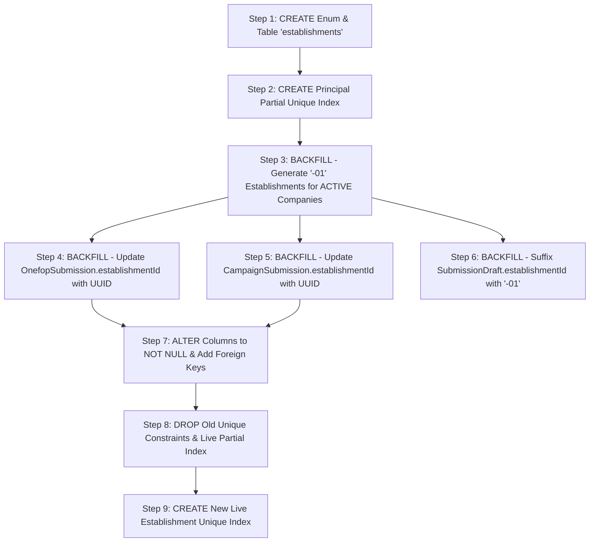

# Phase E.1 — Schema, Migration & Backfill Inventory Plan

> **Ordering Constraint**: Phase E.1 is not standalone. After E.1, `OnefopSubmission.establishmentId` is NOT NULL and FK-constrained. Any company approved between E.1 landing and E.2a landing has no Establishment row, so submitting a return would violate the FK. E.1 must ship together with the `AuthService.approveUser` change that mints the `-01` Establishment at approval time, or E.1 must wait until E.2a is ready.

## Phase E.1 Execution Checklist

0. **Step 0 — Confirm Approval Readiness**: Confirm `AuthService.approveUser` is ready to mint the `-01` Establishment on approval. If not, hold E.1 until it is.
1. **Pre-backfill Active IDs**: Run `scripts/backfill-company-establishment-ids.ts --actor-email=<an active SUPER_ADMIN, SUPER_ADMIN_ONEFOP, or CENTRAL user> --apply` against dev DB. The script writes an audit row attributed to that user, so the account must exist and be active.
2. **Territory Null-Audit**: Run territory null-audit query; inspect and fix broken records by hand if needed.
3. **Write Migration**: Write and commit `prisma/migrations/<timestamp>_phase_e1_establishments/migration.sql` with DDL and backfill statements.
4. **Staging Deploy & Verification**: Test on `dsmo-test` with `npx prisma migrate deploy` followed by `npx prisma migrate diff` to verify schema parity.
5. **Production Deploy**: Apply automatically via Render on merge to master.

---

## 1. Schema Changes Required

The following diff-style blocks represent the target changes to `prisma/schema.prisma`.

### 1.1 New Enum & Model: `Establishment`

```prisma
+enum EstablishmentStatus {
+  ACTIVE
+  CLOSED
+  SUSPENDED
+}
+
+model Establishment {
+  id              String               @id @default(uuid())
+  code            String               @unique // e.g. EN26000100-01 (13 chars)
+  name            String               // Site label, e.g. "Siège Social" / "Usine de Bonabéri"
+  isPrincipal     Boolean              @default(false)
+  status          EstablishmentStatus  @default(ACTIVE)
+
+  companyId       String
+  company         Company              @relation(fields: [companyId], references: [id], onDelete: Restrict)
+
+  // Territory hierarchy (canonical FKs + denormalized text)
+  regionId        String
+  departmentId    String
+  subdivisionId   String
+  region          String
+  department      String
+  subdivision     String
+  address         String
+  phone           String?
+  email           String?
+
+  createdAt       DateTime             @default(now())
+  updatedAt       DateTime             @updatedAt
+
+  submissions     OnefopSubmission[]
+  campaignTargets CampaignSubmission[]
+
+  @@index([companyId])
+  @@index([regionId])
+  @@index([departmentId])
+  @@index([subdivisionId])
+  @@map("establishments")
+}
```

### 1.2 Model: `Company`

```prisma
 model Company {
   id                         String                  @id @default(uuid())
   // ... existing fields ...
   establishmentId            String?                 @unique
+  establishments             Establishment[]
   // ... existing fields ...
 }
```

### 1.3 Model: `OnefopSubmission`

```prisma
 model OnefopSubmission {
   id                    String                        @id @default(uuid())
   // ... existing fields ...
   companyId             String?
-  establishmentId       String?
+  establishmentId       String
+  establishment         Establishment                 @relation(fields: [establishmentId], references: [id], onDelete: Restrict)
   quarterCode           String?                       @default("2025-T1")
   // ... existing fields ...
 }
```

### 1.4 Model: `CampaignSubmission`

```prisma
 model CampaignSubmission {
   id              String           @id @default(uuid())
   campaignId      String
   companyId       String?
   submittedAt     DateTime?
   createdAt       DateTime         @default(now())
   updatedAt       DateTime         @updatedAt
-  establishmentId String?
+  establishmentId String
   status          SubmissionStatus @default(PENDING)
   campaign        DataCampaign     @relation(fields: [campaignId], references: [id], onDelete: Cascade)
   company         Company?         @relation(fields: [companyId], references: [id], onDelete: Restrict)
+  establishment   Establishment    @relation(fields: [establishmentId], references: [id], onDelete: Restrict)

-  @@unique([campaignId, companyId])
   @@unique([campaignId, establishmentId])
   @@index([campaignId])
   @@index([companyId])
   @@index([establishmentId])
   @@map("campaign_submissions")
 }
```

### 1.5 Model: `SubmissionDraft`

```prisma
 model SubmissionDraft {
   id              String           @id @default(uuid())
-  establishmentId String
+  // Holds 13-character site code (e.g. EN26000100-01), unlike OnefopSubmission UUID FK.
+  // Recommended future cleanup: rename column to siteCode.
+  establishmentId String
   quarterCode     String
   entityType      OnefopEntityType
   // ... existing fields ...
   @@unique([establishmentId, quarterCode])
   @@index([establishmentId])
   @@map("submission_drafts")
 }
```

---

## 2. Migration Steps, Ordered

PostgreSQL supports transactional DDL (`BEGIN ... COMMIT`), allowing DDL and backfill operations to execute atomically. In dev environment, the database can simply be reset if needed.



### Step 1: DDL — Enum & Establishment Table
- **Action**: Create `EstablishmentStatus` enum and `establishments` base table.
- **SQL**:
  ```sql
  CREATE TYPE "EstablishmentStatus" AS ENUM ('ACTIVE', 'CLOSED', 'SUSPENDED');

  CREATE TABLE "establishments" (
      "id" UUID NOT NULL DEFAULT gen_random_uuid(),
      "code" VARCHAR(20) NOT NULL,
      "name" VARCHAR(255) NOT NULL,
      "isPrincipal" BOOLEAN NOT NULL DEFAULT false,
      "status" "EstablishmentStatus" NOT NULL DEFAULT 'ACTIVE',
      "companyId" UUID NOT NULL,
      "regionId" VARCHAR(255) NOT NULL,
      "departmentId" VARCHAR(255) NOT NULL,
      "subdivisionId" VARCHAR(255) NOT NULL,
      "region" VARCHAR(255) NOT NULL,
      "department" VARCHAR(255) NOT NULL,
      "subdivision" VARCHAR(255) NOT NULL,
      "address" TEXT NOT NULL DEFAULT '',
      "phone" VARCHAR(255),
      "email" VARCHAR(255),
      "createdAt" TIMESTAMP(3) NOT NULL DEFAULT CURRENT_TIMESTAMP,
      "updatedAt" TIMESTAMP(3) NOT NULL DEFAULT CURRENT_TIMESTAMP,
      CONSTRAINT "establishments_pkey" PRIMARY KEY ("id"),
      CONSTRAINT "establishments_code_key" UNIQUE ("code"),
      CONSTRAINT "establishments_companyId_fkey" FOREIGN KEY ("companyId") REFERENCES "companies"("id") ON DELETE RESTRICT ON UPDATE CASCADE
  );

  CREATE INDEX "establishments_companyId_idx" ON "establishments"("companyId");
  CREATE INDEX "establishments_regionId_idx" ON "establishments"("regionId");
  CREATE INDEX "establishments_departmentId_idx" ON "establishments"("departmentId");
  CREATE INDEX "establishments_subdivisionId_idx" ON "establishments"("subdivisionId");
  ```

### Step 2: DDL — Partial Unique Index on Principal Site
- **Action**: Enforce exactly one principal establishment per company at the database engine level.
- **SQL**:
  ```sql
  CREATE UNIQUE INDEX "establishments_company_principal_uidx"
    ON "establishments" ("companyId")
    WHERE "isPrincipal" = true;
  ```

### Step 3: DML Backfill — Generate Principal `-01` Establishments (ACTIVE Only)
- **Action**: Generate an initial principal establishment record (`-01`) for every active registered company. Unapproved companies (`PENDING_APPROVAL`, `COMPLEMENTS_REQUESTED`, `REJECTED`) are excluded here; their `-01` establishment is generated inside `AuthService.approveUser` upon approval.
- **SQL**:
  ```sql
  INSERT INTO "establishments" (
      "id",
      "code",
      "name",
      "isPrincipal",
      "status",
      "companyId",
      "regionId",
      "departmentId",
      "subdivisionId",
      "region",
      "department",
      "subdivision",
      "address",
      "phone",
      "email",
      "createdAt",
      "updatedAt"
  )
  SELECT
      gen_random_uuid(),
      c."establishmentId" || '-01',
      COALESCE(NULLIF(TRIM(c.name), ''), 'Siège Principal'),
      true,
      'ACTIVE'::"EstablishmentStatus",
      c.id,
      c."regionId",
      c."departmentId",
      c."subdivisionId",
      c.region,
      c.department,
      c.subdivision,
      COALESCE(c.address, ''),
      c.phone,
      u.email,
      c."createdAt",
      CURRENT_TIMESTAMP
  FROM "companies" c
  JOIN "users" u ON u.id = c."userId"
  WHERE u.status = 'ACTIVE'
    AND c."establishmentId" IS NOT NULL
    AND c."regionId" IS NOT NULL
    AND c."departmentId" IS NOT NULL
    AND c."subdivisionId" IS NOT NULL;
  ```

### Step 4: DML Backfill — Relink `OnefopSubmission.establishmentId` to UUID
- **Action**: Overwrite the loose 10-character company code stored in `onefop_submissions.establishmentId` with the newly generated `Establishment.id` UUID of the principal site.
- **SQL**:
  ```sql
  UPDATE "onefop_submissions" s
  SET "establishmentId" = e.id::text
  FROM "establishments" e
  WHERE e."companyId" = s."companyId"
    AND e."isPrincipal" = true;
  ```

### Step 5: DML Backfill — Relink `CampaignSubmission.establishmentId` to UUID
- **Action**: Overwrite the string code in `campaign_submissions.establishmentId` with the matching `Establishment.id` UUID.
- **SQL**:
  ```sql
  UPDATE "campaign_submissions" cs
  SET "establishmentId" = e.id::text
  FROM "establishments" e
  WHERE e."companyId" = cs."companyId"
    AND e."isPrincipal" = true;
  ```

### Step 6: DML Backfill — Suffix `SubmissionDraft.establishmentId` with `-01`
- **Action**: Update autosave drafts so their establishment identifier matches the 13-character site business code.
- **SQL**:
  ```sql
  UPDATE "submission_drafts"
  SET "establishmentId" = "establishmentId" || '-01'
  WHERE "establishmentId" IS NOT NULL
    AND "establishmentId" NOT LIKE '%-%';
  ```

### Step 7: DDL — Enforce Foreign Keys & NOT NULL
- **Action**: Add explicit foreign key constraints and enforce `NOT NULL` on `OnefopSubmission` and `CampaignSubmission`.
- **SQL**:
  ```sql
  ALTER TABLE "onefop_submissions"
    ALTER COLUMN "establishmentId" SET NOT NULL;

  ALTER TABLE "onefop_submissions"
    ADD CONSTRAINT "onefop_submissions_establishmentId_fkey"
    FOREIGN KEY ("establishmentId") REFERENCES "establishments"("id")
    ON DELETE RESTRICT ON UPDATE CASCADE;

  ALTER TABLE "campaign_submissions"
    ALTER COLUMN "establishmentId" SET NOT NULL;

  ALTER TABLE "campaign_submissions"
    ADD CONSTRAINT "campaign_submissions_establishmentId_fkey"
    FOREIGN KEY ("establishmentId") REFERENCES "establishments"("id")
    ON DELETE RESTRICT ON UPDATE CASCADE;
  ```

### Step 8: DDL — Drop Obsolete Constraints
- **Action**: Drop the compound constraint on `CampaignSubmission` and the obsolete company-level live unique index on `OnefopSubmission`.
- **SQL**:
  ```sql
  ALTER TABLE "campaign_submissions"
    DROP CONSTRAINT IF EXISTS "campaign_submissions_campaignId_companyId_key";

  DROP INDEX IF EXISTS "onefop_submissions_company_quarter_live_uidx";
  ```

### Step 9: DDL — Create Establishment Live Return Unique Index
- **Action**: Create the new live return uniqueness constraint preventing duplicate `PENDING_REVIEW` or `APPROVED` returns for the same physical establishment and quarter.
- **SQL**:
  ```sql
  CREATE UNIQUE INDEX "onefop_submissions_establishment_quarter_live_uidx"
    ON "onefop_submissions" ("establishmentId", "quarterCode")
    WHERE "status" IN ('PENDING_REVIEW', 'APPROVED');
  ```

---

## 3. Failure Modes & Mitigations

| Failure Mode | Root Cause | Impact | Action / Resolution |
| :--- | :--- | :--- | :--- |
| **1. Active Companies with null `establishmentId` ("The 29 Case")** | Active companies registered before R.1 approval automation that were never issued an ID. | Step 3 skips them (`WHERE establishmentId IS NOT NULL`). If any such company has submissions, Step 4 leaves `establishmentId` as null, failing Step 7 (`SET NOT NULL`). | **Run Pre-Backfill**: Execute `scripts/backfill-company-establishment-ids.ts --apply` before running migration. Confirm 0 active companies remain with null establishmentId. |
| **2. Unapproved Companies (`PENDING_APPROVAL`, etc.)** | Registrations awaiting staff review that do not yet hold an `establishmentId`. | Excluded by design in Step 3 (`u.status = 'ACTIVE'`). | **Deferred to Approval**: Unapproved companies do not get an `Establishment` row during migration. Their principal establishment (`-01`) is generated inside `AuthService.approveUser` at approval time. |
| **3. Companies with Incomplete Territory (`regionId IS NULL`)** | In `companies`, `regionId`, `departmentId`, and `subdivisionId` are nullable strings. In `establishments`, they are non-nullable. | Step 3 skips these companies. Any associated submission will fail Step 7 (`SET NOT NULL`). | **Manual Fix**: Run territory null-audit query. Fix any broken active company records by hand directly in the dev DB prior to migration. |
| **4. Orphan Submissions with Null or Dangling `companyId`** | Test data or corrupted legacy submissions where `companyId IS NULL` or references a deleted company ID. | Step 4 cannot match an `Establishment`, leaving `onefop_submissions.establishmentId` unchanged. Step 7 fails on FK constraint. | **Cleanup Query**: Run `SELECT count(*) FROM onefop_submissions WHERE "companyId" IS NULL OR "companyId" NOT IN (SELECT id FROM companies);`. Delete or repair orphan test submissions in dev DB. |
| **5. Duplicate `CampaignSubmission` on `(campaignId, establishmentId)`** | Data drift or repeated insertion during testing where multiple campaign targets exist for the same company. | Step 5 converts both rows to the same principal `Establishment.id`. The `@@unique([campaignId, establishmentId])` index creation fails with duplicate key error. | **Deduplication**: Run `SELECT "campaignId", "companyId", count(*) FROM campaign_submissions GROUP BY "campaignId", "companyId" HAVING count(*) > 1;`. Delete duplicate campaign submission cards. |
| **6. Orphan `SubmissionDraft` Rows** | Drafts created during testing that already contain a hyphen or belong to purged companies. | Blindly concatenating `|| '-01'` could produce malformed identifiers (`EST-123-01`) or clash on `@@unique([establishmentId, quarterCode])`. | **Guarded SQL**: Step 6 uses `WHERE "establishmentId" NOT LIKE '%-%'`. If collision occurs, remove stale duplicate drafts keeping the latest `lastSavedAt`. |

---

## 4. Reversibility

While a theoretical down-migration script can reverse the DDL (dropping `establishments` and restoring loose string columns), in this development environment no complex rollback ceremony is exercised: if a migration defect occurs, the dev database can simply be reset and re-seeded.

---

## 5. Test Plan & Staging Validation

Before applying Phase E.1, execute the following audit and test steps on `dsmo-test`:

### Phase 1: Pre-Flight Audit Queries (Direct SQL)

```sql
-- 1. Verify 0 duplicate establishment IDs among existing companies
SELECT "establishmentId", COUNT(*)
FROM companies
WHERE "establishmentId" IS NOT NULL
GROUP BY "establishmentId"
HAVING COUNT(*) > 1;

-- 2. Verify 0 active companies missing establishment IDs (must be 0 after backfill script)
SELECT c.id, c.name
FROM companies c
JOIN users u ON u.id = c."userId"
WHERE u.status = 'ACTIVE' AND c."establishmentId" IS NULL;

-- 3. Verify territory completeness for active companies (fix broken rows by hand if any return)
SELECT c.id, c.name
FROM companies c
JOIN users u ON u.id = c."userId"
WHERE u.status = 'ACTIVE'
  AND (c."regionId" IS NULL OR c."departmentId" IS NULL OR c."subdivisionId" IS NULL);

-- 4. Check for orphan submissions lacking valid company links
SELECT count(*)
FROM onefop_submissions
WHERE "companyId" IS NULL OR "companyId" NOT IN (SELECT id FROM companies);

-- 5. Check for duplicate campaign submission targets per company
SELECT "campaignId", "companyId", count(*)
FROM campaign_submissions
GROUP BY "campaignId", "companyId"
HAVING count(*) > 1;
```

### Phase 2: Migration Execution & Drift Verification
```bash
# 1. Apply migration
npx prisma migrate deploy

# 2. Verify zero drift against schema.prisma
npx prisma migrate diff \
  --from-schema-datamodel prisma/schema.prisma \
  --to-migrations prisma/migrations \
  --shadow-database-url "$SHADOW_DATABASE_URL"
```

### Phase 3: Post-Migration Assertion Queries
```sql
-- 1. Confirm all active companies have exactly one principal establishment
SELECT count(*)
FROM companies c
JOIN users u ON u.id = c."userId"
LEFT JOIN establishments e ON e."companyId" = c.id AND e."isPrincipal" = true
WHERE u.status = 'ACTIVE' AND e.id IS NULL; -- Must be 0

-- 2. Confirm zero unlinked submissions
SELECT count(*) FROM onefop_submissions WHERE "establishmentId" IS NULL; -- Must be 0

-- 3. Confirm zero unlinked campaign targets
SELECT count(*) FROM campaign_submissions WHERE "establishmentId" IS NULL; -- Must be 0

-- 4. Confirm draft site code suffix
SELECT count(*) FROM submission_drafts WHERE "establishmentId" NOT LIKE '%-%'; -- Must be 0
```

---

## 6. Estimated Size & Complexity

- **Files Changed**:
  - `prisma/schema.prisma` (+55 lines, -6 lines)
  - `prisma/migrations/202610XXXXXX_phase_e1_establishments/migration.sql` (~130 lines SQL)
  - `src/questionnaires/campaign-review-sync.ts` (~10 lines: switch lookup from `companyId` to `establishmentId`)
  - `src/questionnaires/questionnaires.service.ts` (~25 lines: resolve `establishmentId` to UUID)
  - `src/campaign/campaign.service.ts` (~20 lines: create `CampaignSubmission` targeting principal establishment)
- **Database Scope**:
  - 1 new table (`establishments`)
  - 1 new enum (`EstablishmentStatus`)
  - 3 foreign key constraints added
  - 2 unique constraints/indexes dropped
  - 2 unique indexes created
  - 3 table data backfills executed
- **Risk Level**: **High (Structural Pivot)**  
  Changes the relational foreign key of all historical and future quarterly returns, but operates in a dev environment where the database can be reset if needed.