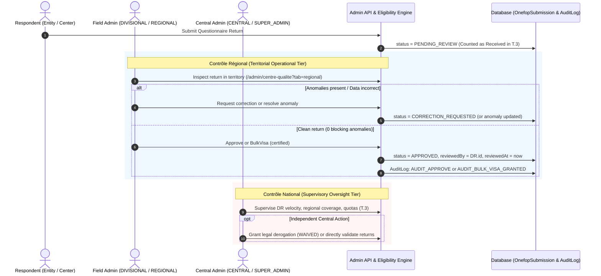

# Regional Review Tier — Architecture & Scoping Specification

## 1. Executive Summary & Clarified Scope

The CAMLEAP / ONEFOP roadmap lists the following backlog item:
> **Regional review tier — medium — workflow and permissions on returns**

Unlike preceding milestones such as **T.3 (Returns vs. Quotas)** or **Phase E (Establishments)**, no formal design specification previously existed for this item.

### The Ambiguity Resolved: Supervisory Tier vs. Approval Ladder

Initial reconnaissance revealed two conflicting architectural possibilities:
1. **A sequential approval-escalation ladder** (modeled after the legacy DSMO module: $\text{Division} \rightarrow \text{Region} \rightarrow \text{Central}$).
2. **A supervisory oversight tier** (separating field execution from central performance monitoring, keeping the workflow state machine flat).

**The scope is now formally settled by stakeholder decisions:**
- **"Regional review tier" refers strictly to a supervisory tier between field administrative execution and central ministerial oversight, NOT a sequential approval-escalation ladder.**
- **`Contrôle régional` (Territorial Operational Tier):** Encompasses front-line administrative execution—entity registrations, data submission verification, anomaly resolution, correction requests, and return validation/approvals. This work is performed by `REGIONAL` and `DIVISIONAL` administrators within their respective geographic jurisdictions. `DIVISIONAL` and `REGIONAL` share the **exact same functional authority**, distinguished solely by geographic scope (Department vs. Region).
- **`Contrôle national` (National Supervisory Tier):** An oversight and monitoring function exercised by central ministry personnel (`CENTRAL`, `SUPER_ADMIN`, `SUPER_ADMIN_ONEFOP`). It supervises and follows up on the performance, activity velocity, and collection coverage of `REGIONAL` and `DIVISIONAL` administrators across the nation. It is **not** a second approval tier through which dossiers must pass.
- **Workflow State Machine Remains Flat:** Survey returns follow the single-tier state machine:
  $$\text{DRAFT} \longrightarrow \text{PENDING\_REVIEW} \longrightarrow \text{APPROVED (or REJECTED / CORRECTION\_REQUESTED)}$$
  The `OnefopStatus` database enum remains frozen. Territorial review authority is recorded via `reviewedBy`, `reviewedAt`, and audit logs. Central administration retains independent authority to inspect and approve returns at any time without requiring prior regional sign-off.

---

## 2. Historical Candidate Analysis

The following candidates reflect the architectural options evaluated prior to the stakeholder clarification, documenting why alternative approaches were rejected.

```mermaid
flowchart TD
    subgraph Candidate 1: Hierarchical 3-Tier Escalation (REJECTED)
        C1_SUB["PENDING_REVIEW<br/>(Submitted)"] -->|Divisional Visa| C1_DIV["DIVISION_APPROVED"]
        C1_DIV -->|Regional Visa| C1_REG["REGION_APPROVED"]
        C1_REG -->|Central Ministerial Approval| C1_APP["APPROVED<br/>(Exportable)"]
    end

    subgraph Candidate 2: Two-Tier Regional Gate to Central Lock (REJECTED)
        C2_SUB["PENDING_REVIEW<br/>(Field Ingestion)"] -->|Regional Visa / Bulk Visa| C2_REG["REGIONAL_VISA<br/>(Validated in Territory)"]
        C2_REG -->|Central Approval / Lock| C2_APP["APPROVED<br/>(Final Ministerial Lock)"]
    end

    subgraph Approved Model: Field Execution vs. National Supervision
        AM_SUB["PENDING_REVIEW<br/>(Territorial Ingestion)"]
        AM_SUB -->|Territorial Review: Divisional & Regional Admins| AM_APP["APPROVED<br/>(Definitive in Territory)"]
        AM_SUB -->|Independent Central Review| AM_APP
        AM_SUP["Contrôle National<br/>(Central Administrative Oversight of DR Activity & Coverage)"] -.->|Supervises DR Admins| AM_SUB
    end
```

---

### Candidate 1: Sequential Multi-Tier Approval Workflow (DSMO Parity) — REJECTED

- **One-line definition:** ONEFOP adopts DSMO's sequential multi-step approval ladder, requiring a return to be successively endorsed by Division, validated by Region, and given final approval by Central before it is considered `APPROVED` and statistically exportable.
- **What the code says today:**
  - *Evidence for:*
    - Stubbed enum members in [src/types/eligibility.types.ts](file:///c:/Users/win/dsmo_app/src/types/eligibility.types.ts#L8-L15):
      `EXCL_WAITING_DIV_VISA`, `EXCL_WAITING_REG_VISA`, `EXCL_WAITING_NAT_VISA`.
    - Stubbed queue counters in [src/questionnaires/eligibility-engine.service.ts](file:///c:/Users/win/dsmo_app/src/questionnaires/eligibility-engine.service.ts#L285-L287):
      `pendingRegionalVisasCount: 0, // Reserved for multi-tier regional routing`.
    - DSMO's active implementation in [src/dsmo/dsmo.service.ts](file:///c:/Users/win/dsmo_app/src/dsmo/dsmo.service.ts#L624-L629) and [prisma/schema.prisma](file:///c:/Users/win/dsmo_app/prisma/schema.prisma#L1899-L1906):
      `DeclarationStatus` has `DRAFT`, `SUBMITTED`, `DIVISION_APPROVED`, `REGION_APPROVED`, `FINAL_APPROVED`, `REJECTED`.
  - *Evidence against:*
    - `OnefopStatus` in [prisma/schema.prisma](file:///c:/Users/win/dsmo_app/prisma/schema.prisma#L1939-L1945) has no intermediate approval states.
    - `approve()` in [src/questionnaires/questionnaires.service.ts](file:///c:/Users/win/dsmo_app/src/questionnaires/questionnaires.service.ts#L3133-L3143) and `executeBulkVisa()` in [src/questionnaires/eligibility-engine.service.ts](file:///c:/Users/win/dsmo_app/src/questionnaires/eligibility-engine.service.ts#L443-L450) transition directly from `PENDING_REVIEW` to `APPROVED`.
    - Statistical export where-builder in [src/questionnaires/eligibility-engine.service.ts](file:///c:/Users/win/dsmo_app/src/questionnaires/eligibility-engine.service.ts#L153-L160) (`getStatisticalEligibilityWhere`) strictly checks `status: OnefopStatus.APPROVED`. Intermediate states would exclude returns endorsed by regions from all statistical exports.
- **Why Rejected:** Contradicts the "Medium" roadmap estimate, duplicates legacy DSMO complexity that was deliberately frozen in [docs/deferred.md](file:///c:/Users/win/dsmo_app/docs/deferred.md#L13-L33), and would paralyze campaign operations by requiring 3 sequential human sign-offs on thousands of statistical questionnaires.

---

### Candidate 2: Two-Tier Review — Regional Visa as Gate to Central Lock — REJECTED

- **One-line definition:** Returns submitted by entities are screened and granted a formal territorial visa by Regional staff, placing them into a Central National queue for mandatory ministerial locking/validation.
- **Why Rejected:** Rejected per Stakeholder Decision 2 (independent review) and Decision 3 (frozen schema). Central does not require prior regional approval to act, and returns do not undergo a two-phase status lock.

---

### Candidate 3: Role-Differentiated Scoping & Regional Queue Hardening — ADOPTED & REFINED

- **One-line definition:** The "regional review tier" does not introduce new workflow statuses; instead, it establishes the operational boundaries, permissions, and specialized supervision queues for Regional and Divisional staff on returns (the returns counterpart to Decision D3 for registrations).
- **Refinement from Stakeholder Decisions:**
  - `DIVISIONAL` and `REGIONAL` possess the same functional approval authority, differentiated only by territorial scope (Department vs. Region).
  - The tier distinction is between field operational execution (`Contrôle régional`) and central supervisory oversight (`Contrôle national`).

---

## 3. Evidence Analysis: Code Realities & Friction Points

### Specific Line Citations & Architectural Status

| Component / File | Specific Lines | Architectural Signal | Status Under Clarified Scope |
|---|---|---|---|
| **Eligibility Types** | [src/types/eligibility.types.ts](file:///c:/Users/win/dsmo_app/src/types/eligibility.types.ts#L8-L15) | Declares `EXCL_WAITING_DIV_VISA`, `EXCL_WAITING_REG_VISA`, `EXCL_WAITING_NAT_VISA`. | **Vestigial code.** These intermediate exclusion reasons are dead constructs from an abandoned multi-tier routing prototype. |
| **Eligibility Queue Stubs** | [src/questionnaires/eligibility-engine.service.ts](file:///c:/Users/win/dsmo_app/src/questionnaires/eligibility-engine.service.ts#L286-L287) | `pendingRegionalVisasCount: 0, // Reserved for multi-tier regional routing`. | **Reframe comment & wire count.** Should reflect pending territorial submissions for the caller's jurisdiction rather than a sequential routing stage. |
| **Single-Tier Approval** | [src/questionnaires/questionnaires.service.ts](file:///c:/Users/win/dsmo_app/src/questionnaires/questionnaires.service.ts#L3133-L3143) | `approve()` sets `status: 'APPROVED'` immediately. | **Confirmed.** Workflow remains single-tier. Needs audit log row added to close audit gap. |
| **Bulk Visa Execution** | [src/questionnaires/eligibility-engine.service.ts](file:///c:/Users/win/dsmo_app/src/questionnaires/eligibility-engine.service.ts#L443-L450) | `executeBulkVisa()` sets `status: OnefopStatus.APPROVED` directly for candidates in transaction. | **Confirmed.** Both `DIVISIONAL` and `REGIONAL` retain access to `bulkVisa` within their territory. |
| **Territorial Guarding** | [src/auth/territory.ts](file:///c:/Users/win/dsmo_app/src/auth/territory.ts#L123-L161) | `assertTerritorialAuthority()` enforces Department and Region boundaries for actors. | **Fully aligned.** Serves as the security foundation for territorial review. |
| **Derogation Privilege** | [src/questionnaires/eligibility-engine.service.ts](file:///c:/Users/win/dsmo_app/src/questionnaires/eligibility-engine.service.ts#L303-L315) | Restricts `LEGAL_DEROGATION` to Central/SuperAdmin. | **Confirmed.** Axis 2 legal waivers remain central; field roles resolve standard data discrepancies. |
| **Controller Role Gate** | [src/questionnaires/admin-questionnaires.controller.ts](file:///c:/Users/win/dsmo_app/src/questionnaires/admin-questionnaires.controller.ts#L48-L50) | Controller is gated to `CENTRAL`, `REGIONAL`, `DIVISIONAL`, `SUPER_ADMIN`, `SUPER_ADMIN_ONEFOP`. | **Fully aligned.** All review endpoints remain accessible to field roles within their territory. |
| **React Pipeline** | [react-web/src/app/admin/pilotage/page.tsx](file:///c:/Users/win/dsmo_app/react-web/src/app/admin/pilotage/page.tsx#L371-L378) | Pipeline presents `Contrôle régional` and `Contrôle national` as consecutive steps in a single funnel. | **Conceptual friction.** Visual presentation needs adjustment: Contrôle national oversees regional activity, rather than acting as a dossier gate. |
| **Statistical Export Gate** | [src/questionnaires/eligibility-engine.service.ts](file:///c:/Users/win/dsmo_app/src/questionnaires/eligibility-engine.service.ts#L153-L160) | `getStatisticalEligibilityWhere()` strictly queries `status: OnefopStatus.APPROVED`. | **Fully aligned.** Because status transitions remain flat, exports work seamlessly without regression. |

### Code Alignment and Friction Points

1. **Where the Code Already Aligns:**
   - **Full Approval Parity:** `QuestionnairesService.approve()` and `EligibilityEngineService.executeBulkVisa()` already permit `DIVISIONAL` and `REGIONAL` officers to approve returns directly (subject to `assertTerritorialAuthority`). Decision 1 validates this parity.
   - **Independent Central Access:** Central administrators already possess national scope in `src/auth/territory.ts:136` (`NATIONAL_ROLES` bypasses territorial match), enabling immediate central action without waiting for regional sign-off.
   - **Decoupled Quota Aggregation:** Task T.3 (`pilotage-returns.service.ts`) counts `PENDING_REVIEW`, `APPROVED`, and `CORRECTION_REQUESTED` as "Received". Decision 5 confirms this counting rule stands unchanged.

2. **Frictions and Vestigial Artifacts to Flag:**
   - **Vestigial Multi-Tier Stubs:** `src/types/eligibility.types.ts:8-16` contains `EXCL_WAITING_DIV_VISA`, `EXCL_WAITING_REG_VISA`, and `EXCL_WAITING_NAT_VISA`. These must be treated as dead code and not referenced in new features.
   - **Misleading Service Comment:** `src/questionnaires/eligibility-engine.service.ts:286-287` comments `// Reserved for multi-tier regional routing`. In reality, routing is territorial scoping, not multi-tier routing.
   - **Audit Trail Disparity:** Single-dossier `approve` in `questionnaires.service.ts:3139` writes no `AuditLog` entry, whereas `executeBulkVisa`, `reject`, and `requestCorrection` do. Under Decision 3, single-dossier approval must write an audit record so regional action is formally attested in the metadata log.
   - **UI Funnel Visual Misconception:** In `react-web/src/app/admin/pilotage/page.tsx`, displaying `Contrôle régional` and `Contrôle national` as sequential stages in a 6-stage funnel misleads administrators into expecting a two-step approval process.

---

## 4. Approved Architecture & Implementation Scope

### Architecture Overview



### Concrete Implementation Work (Target Size: Medium)

1. **Audit Coverage (Backend):**
   - In [src/questionnaires/questionnaires.service.ts](file:///c:/Users/win/dsmo_app/src/questionnaires/questionnaires.service.ts#L3139), add an `AuditLog` entry to `approve()` (`action: 'AUDIT_APPROVE'`), capturing `userId`, `submissionId`, `actorRole`, and territorial jurisdiction. This completes Decision 3.

2. **Pilotage & Queue Metrics (Backend):**
   - In [src/questionnaires/eligibility-engine.service.ts](file:///c:/Users/win/dsmo_app/src/questionnaires/eligibility-engine.service.ts#L285-L287), update `getPilotageQueues`:
     - `pendingRegionalVisasCount`: Return the count of `PENDING_REVIEW` submissions inside the calling user's territory requiring verification.
     - `pendingNationalVisasCount`: For national administrators, return total national `PENDING_REVIEW` submissions; for field administrators, return 0 or null.
     - Clean up obsolete comments referencing "multi-tier regional routing".

3. **Regional Quality Center UI (Frontend):**
   - In `react-web/src/app/admin/centre-qualite/page.tsx` (and `_routes.ts`):
     - Wire the `/admin/centre-qualite?tab=regional` tab to display returns within the user's territory awaiting territorial review/visa.
     - Enable batch inspection and territorial `bulkVisa` execution for both `DIVISIONAL` and `REGIONAL` users.

4. **Pilotage Dashboard Refinement (Frontend):**
   - In `react-web/src/app/admin/pilotage/page.tsx`:
     - Reframe the 6-stage pipeline so that `Contrôle régional` reflects pending territorial verification workload and `Contrôle national` reflects central supervision metrics, avoiding the false appearance of a sequential approval bottleneck.

---

## 5. Resolved Decisions

The following architectural decisions are formally approved and govern implementation:

1. **Divisional Approval Authority:**
   **Approved.** Officers with the `DIVISIONAL` role possess full approval authority on returns (`approve` and `bulkVisa`). `DIVISIONAL` and `REGIONAL` share the same functional role and review capabilities, distinguished strictly by their territorial jurisdiction (Department vs. Region) as enforced by `assertTerritorialAuthority`.

2. **Sequential vs. Independent Review:**
   **Independent.** No regional sign-off is required before Central administrators can act. Central directors and superadministrators may inspect, validate, or reject returns at any time across the national territory without waiting for prior departmental or regional visas.

3. **Schema Status vs. Metadata:**
   **Metadata only.** No new `OnefopStatus` values will be added. The `OnefopStatus` enum remains strictly frozen at:
   `DRAFT`, `PENDING_REVIEW`, `APPROVED`, `REJECTED`, `CORRECTION_REQUESTED`.
   Territorial review authority is captured via the existing `reviewedBy` (storing actor User ID with their assigned role and jurisdiction), `reviewedAt`, and permanent `AuditLog` trails.

4. **Contrôle Régional vs. Contrôle National:**
   **Clarified:**
   - **Contrôle régional:** The territorial operational tier. Encompasses registration validation and submission data quality control executed by `REGIONAL` and `DIVISIONAL` admins within their territory.
   - **Contrôle national:** The national supervisory tier. Encompasses central ministry administrators supervising and following up on the activity, coverage, and review pace of `REGIONAL` and `DIVISIONAL` field admins. It is an oversight function over administrators and operational performance, **not** a second approval tier over dossiers.
   The "review tier" in this feature refers strictly to this supervisory separation between field work and central oversight, not a multi-tier approval ladder.

5. **Campaign Quota Tracking (T.3):**
   **No change.** Submissions with status `PENDING_REVIEW` continue to count as "Received" toward territorial campaign quotas as established in T.3. Quota fulfillment does not require prior approval.
