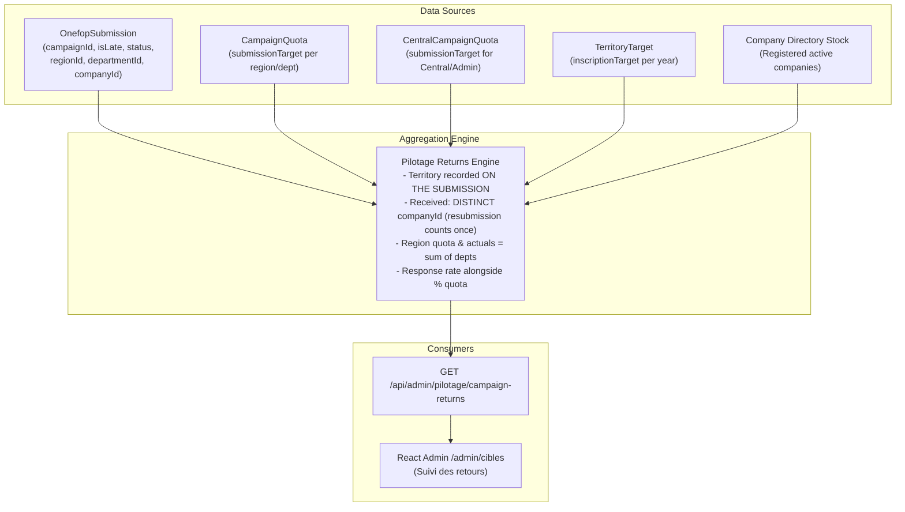

# T.3 — Campaign Returns vs. Quotas Design Document

## 1. Executive Summary & Objective

The goal of Task T.3 is to provide administrative and pilotage visibility comparing **received ONEFOP campaign returns** against configured targets (**`CampaignQuota`** and **`TerritoryTarget`**) across all levels of Cameroon's administrative hierarchy:
$$\text{Department} \longrightarrow \text{Region} \longrightarrow \text{National (Central \& Global)}$$

This capability enables the Ministry (MINEFOP), central directors, and regional/divisional delegates to:
1. Track questionnaire collection progress in real time during active campaigns.
2. Measure quota achievement rates ($\% \text{ of Quota}$) and identify collection deficits ($\text{Gaps}$).
3. Monitor timeliness ($\text{On-Time}$ vs. $\text{Late}$) driven by effective campaign deadlines.
4. Calculate territorial **response rate** ($\text{Received} / \text{Registered active companies in territory}$) alongside $\% \text{ of Quota}$.
---

## 2. Data Sources & Architecture



### 2.1 Relational Sources
- **`OnefopSubmission`**:
  - `campaignId`: Foreign key linking the questionnaire return directly to a `DataCampaign` (populated via Phase 0.3 / B1).
  - `isLate`: Boolean flag calculated upon submission against `effectiveDeadlineSnapshot`.
  - `status`: Workflow status (`DRAFT`, `SUBMITTED`, `PENDING_REVIEW`, `UNDER_REVIEW`, `APPROVED`, `REJECTED`, `CORRECTION_REQUESTED`).
  - `submissionDate` & `createdAt`: Timestamps of return filing.
  - `regionId` & `departmentId`: Territorial jurisdiction recorded **on the submission** (not the company's current territory; R.1 lets companies move region).
  - `companyId` & `establishmentId`: Reporting entity identifiers.
- **`CampaignQuota`**:
  - Stores `submissionTarget` (Int) keyed by `(campaignId, regionId, departmentId)`.
  - Department rows have both `regionId` and `departmentId`.
  - Region quota and region actuals = sum of departments (same rule as targets).
- **`CentralCampaignQuota`**:
  - Stores `submissionTarget` (Int) for central public administration entities keyed by `campaignId` (PROPOSED treatment).
- **`TerritoryTarget`**:
  - Annual target for registered directory stock (`inscriptionTarget`), providing baseline sizing context.
- **`Company` Directory Stock**:
  - Active registered companies (`status = 'ACTIVE'`, `isActive = true`, valid `establishmentId`) within the territory, establishing the eligible reporting universe.

### 2.2 Baseline Exposed by Existing Coverage (`GET /api/admin/pilotage/coverage`)
The current coverage endpoint (`pilotage.service.ts:109`) provides:
- Directory stock: `registered` (total), `registeredInYear` (new in Douala calendar year), `pendingApproval`, `pendingReview`, `complementsRequested`.
- Baseline sizing: `inscriptionTarget` and `rate = registered / inscriptionTarget`.
- Bucket distribution: Central (`kind: 'central'`), Department (`kind: 'department'`), Unassigned, and NullEntityType.

*Limitation of existing coverage*: `getCoverage` is strictly an annual directory stock metric (`year: number`). It does not track campaign questionnaire returns, quarterly periods, submission statuses, or collection deadlines.

---

## 3. Core Rules & Metric Definitions

### 3.1 Territory Attribution of a Return
> **Invariant**: Territory of a return = the territory recorded ON THE SUBMISSION (`OnefopSubmission.regionId` and `OnefopSubmission.departmentId`), not the company's current territory.

*Reason*: R.1 lets companies move region; a return must stay in the region it was submitted from. Under registration management (R.1), companies can change their physical seat or have their territorial assignment adjusted by administrators (`updateUserTerritory`). A submission represents economic and labour data collected for a specific territory at that point in time; historical campaign returns must never shift between departments or regions because an enterprise subsequently relocated.

### 3.2 Unit of Return & Deduplication
- **Current Unit (Phase B/C)**: Received counts **`DISTINCT companyId`** per campaign.[^1]
  - A resubmission after rejection counts once. If a company submits, receives a `REJECTED` status or requests corrections, and resubmits under the same campaign, it counts as exactly one return.
- **Phase E Evolution (Multi-Site Establishments)**:
  - Phase E introduces secondary sites with unique establishment codes (`CompanyCode-01`, `CompanyCode-02`).
  - In Phase E, the unit of return transitions from `DISTINCT companyId` to **`DISTINCT establishmentId`**, enabling multi-site organizations to report per physical establishment while maintaining territorial accuracy.

[^1]: *Footnote*: Phase E switches this to distinct establishment (`DISTINCT establishmentId`).

### 3.3 Status Filtering (Definition of "Received")
- **`Received` (Total Reçus)**: Received = submitted AND not REJECTED:
  $$\text{Received} = \text{DISTINCT companyId WHERE } status \neq \text{'REJECTED'} \land status \neq \text{'DRAFT'}$$
  *(Includes `SUBMITTED`, `PENDING_REVIEW`, `UNDER_REVIEW`, `APPROVED`, `CORRECTION_REQUESTED`).*
- **`Approved` (Validés)**: Submissions officially validated, tracked with a separate `APPROVED` column:
  $$\text{Approved} = \text{DISTINCT companyId WHERE } status = \text{'APPROVED'}$$

### 3.4 Timeliness: On-Time vs. Late
- **`On-Time` (À temps)**: Submissions filed before or on the effective campaign deadline (`isLate === false`).
- **`Late` (En retard)**: Submissions filed after the deadline (`isLate === true`).
- Consistency: $\text{Received} = \text{On-Time} + \text{Late}$.

### 3.5 Quota Achievement & Gaps
- **Quota (`submissionTarget`)**: The target number of questionnaire submissions expected for the territory in that campaign. Region quota and region actuals = sum of departments (same rule as targets).
- **Quota Achievement Rate ($\% \text{ Quota}$)**:
  $$\text{Achievement Rate} = \frac{\text{Received}}{\text{submissionTarget}} \times 100\%$$
  *(Null when `submissionTarget` is not set or $\le 0$).*
- **On-Time Achievement Rate**:
  $$\text{On-Time Rate} = \frac{\text{On-Time}}{\text{submissionTarget}} \times 100\%$$
- **Gap (Écart / Reste à collecter)**:
  $$\text{Gap} = \max(0, \text{submissionTarget} - \text{Received})$$

### 3.6 Territorial Response Rate (Taux de réponse)
In addition to quota attainment ($\% \text{ of Quota}$), pilotage requires measuring coverage against the registered directory:
$$\text{Response Rate} = \frac{\text{Received}}{\text{Registered Active Companies in Territory}} \times 100\%$$
- **Definition**: Response rate = received / registered active companies in the territory (denominator from coverage), alongside $\%$ of quota.
- **Denominator**: Active registered companies belonging to that department/region from the directory stock (same denominator as `CoverageResponse.registered`).
- Provides critical context: reveals whether a 100% quota was set too conservatively relative to the actual enterprise density of the division.

### 3.7 Hierarchical Rollup: Department $\rightarrow$ Region $\rightarrow$ National
- **Department**: Direct counts of submissions whose `departmentId` matches.
- **Region**:
  - **Region Quota**: Region quota = sum of departments (same rule as targets):
    $$\text{Quota}_{\text{Region}} = \sum_{\text{dept} \in \text{Region}} \text{Quota}_{\text{dept}}$$
  - **Region Actuals**: Region actuals = sum of departments (same rule as targets):
    $$\text{Received}_{\text{Region}} = \sum_{\text{dept} \in \text{Region}} \text{Received}_{\text{dept}}$$
    $$\text{OnTime}_{\text{Region}} = \sum_{\text{dept} \in \text{Region}} \text{OnTime}_{\text{dept}}$$
    $$\text{Late}_{\text{Region}} = \sum_{\text{dept} \in \text{Region}} \text{Late}_{\text{dept}}$$
- **National**: Sum of all regional actuals plus central administration returns.

---

## 4. Public Administration Entities (`ADMINISTRATION`)

In [`src/pilotage/pilotage-coverage.ts:63`](file:///c:/Users/win/dsmo_app/src/pilotage/pilotage-coverage.ts#L63), directory stock classification enforces:
```ts
if (row.entityType === 'ADMINISTRATION') return { kind: 'central' };
```

### Proposed Treatment in T.3:
1. **Central Quota Alignment (PROPOSED)**:
   - Ministries, central directorates, and national public bodies report at the national level against **`CentralCampaignQuota.submissionTarget`**.
   - They do **not** consume or count towards divisional or regional quotas, preventing large ministerial workforces from distorting departmental targets (e.g. Mfoundi in Centre).
2. **Exclusion from Territorial Quotas**:
   - Any `OnefopSubmission` with `formType === 'ADMINISTRATION'` is bucketed under `central` rather than the department of its physical seat.
3. *Status*: PROPOSED treatment. Consistent with `pilotage-coverage.ts:63` as it stands today, but has not been ruled on (see Open Questions in Section 8.2).

---

## 5. API Design Proposal

### 5.1 Architecture: Dedicated Endpoint vs. Extending Coverage
- **Option A (Extend `GET /pilotage/coverage`)**: Add optional `?campaignId=` query param to the existing directory coverage route.
  - *Cons*: `GET /coverage` is built around annual directory stock (`StockCounts`: `registered`, `pendingApproval`, etc.). Adding campaign submission counters, deadlines, and lateness metrics overloads the data model and conflates directory size with campaign operations.
- **Option B (Recommended — Dedicated Endpoint `GET /pilotage/campaign-returns`)**:
  - Clean separation of concerns.
  - Direct alignment with campaign lifecycle (`campaignId`).
  - Mirrors permissions of `getCampaignQuotas` (`PILOTAGE_READ_ROLES`).

### 5.2 Endpoint Specification

```http
GET /api/admin/pilotage/campaign-returns?campaignId=:campaignId
```

#### Security & Scoping
- **Guards**: `JwtAuthGuard`, `RolesGuard`, `ActiveCompanyGuard`.
- **Roles**: `PILOTAGE_READ_ROLES` (`SUPER_ADMIN`, `SUPER_ADMIN_ONEFOP`, `CENTRAL`, `REGIONAL`, `DIVISIONAL`).
- **Territory Scoping**:
  - `SUPER_ADMIN`, `SUPER_ADMIN_ONEFOP`, `CENTRAL`: Full national response.
  - `REGIONAL`: Scoped to user's assigned region (all departments within).
  - `DIVISIONAL`: Scoped to user's assigned department.

#### Response Payload Schema (TypeScript)

```typescript
export interface CampaignReturnsSummary {
  id: string;
  name: string;
  code: string;
  collectionType: string;
  status: string;
  startDate: string;
  endDate: string;
  referenceYear: number;
  referenceQuarter: number;
}

export interface ReturnMetrics {
  quota: number | null;                // submissionTarget from CampaignQuota
  received: number;                    // distinct companyId submitted & not rejected
  approved: number;                    // distinct companyId approved
  onTime: number;                      // distinct companyId submitted on-time
  late: number;                        // distinct companyId submitted late
  gap: number | null;                  // max(0, quota - received)
  quotaRate: number | null;            // received / quota (0.0 to 1.0+)
  onTimeRate: number | null;           // onTime / quota
  registeredStock: number;             // active registered companies in territory
  responseRate: number | null;         // received / registeredStock (denominator from coverage)
}

export interface DepartmentReturnRow extends ReturnMetrics {
  departmentId: string;
  name: string;
}

export interface RegionReturnRow extends ReturnMetrics {
  regionId: string;
  name: string;
  mode: TargetMode;                    // UNSET | DEPARTMENT | REGION | MIXED
  departments: DepartmentReturnRow[];
}

export interface CampaignReturnsResponse {
  campaign: CampaignReturnsSummary;
  central: ReturnMetrics | null;       // Administration returns vs CentralCampaignQuota
  unassigned: ReturnMetrics | null;    // Defensive bucket (expected empty / 0)
  regions: RegionReturnRow[];
  totals: ReturnMetrics;               // National rollup (scoped to user's jurisdiction)
}
```

---

## 6. React Web UI Design (`/admin/cibles`)

### 6.1 View Architecture
In `react-web/src/app/admin/cibles/page.tsx`, the current navigation supports:
```typescript
type Vue = "inscriptions" | "couverture" | "quotas";
```
We introduce a fourth view mode:
```typescript
type Vue = "inscriptions" | "couverture" | "quotas" | "retours";
```
Labeled in the tab bar as:
- `Objectifs d'inscription`
- `Couverture du répertoire`
- `Quotas de campagne`
- **`Suivi des retours`** *(New)*

### 6.2 Campaign Context Selector
When `vue === "retours"`, the campaign picker dropdown is active (identical to `vue === "quotas"`). Users select an active or past ONEFOP campaign to inspect returns.

### 6.3 UI Table Layout (`CampaignReturnsTable.tsx`)
A tree table mirroring `TargetGrid` and `CoverageTable`:
1. **Header Row**:
   - `Territoire` (Region / Department expander)
   - `Quota` (Objectif fixé)
   - `Reçus` (Total déclarations valides/déposées)
   - `Validés` (Approuvés)
   - `À temps` (Respect des délais)
   - `En retard` (Hors délai)
   - `Écart` (Manquants)
   - `Taux de quota` (Progress bar / Badge)
   - `Taux de réponse` (% du répertoire actif, dénominateur issu de la couverture)
2. **Visual Hierarchy & Indicators**:
   - **Progress Badges**:
     - $\ge 100\%$: Green badge (`cam-badge-success`).
     - $75\% - 99\%$: Blue badge (`cam-badge-info`).
     - $50\% - 74\%$: Yellow badge (`cam-badge-warning`).
     - $< 50\%$: Red badge (`cam-badge-danger`).
   - **Lateness Indicator**: When $\text{Late} > 0$, display a subtle warning tag next to the count.
   - **Expandable Region Rows**: Toggle chevron revealing all departments with subtotals.
   - **Central Section**: Prominent callout row for `"Niveau central (Administrations)"` comparing ministerial returns against `CentralCampaignQuota`.

---

## 7. Edge Cases & Defensive Handling

| Edge Case | Description | System Behavior |
| :--- | :--- | :--- |
| **Unassigned Territory** | Submissions lacking valid `regionId` or `departmentId`. | Kept as defensive `unassigned` bucket in response; note it should be empty since territory is mandatory on submission and all companies were backfilled. |
| **ARCHIVED Campaign** | Viewing past campaigns that are closed or archived. | Read-only presentation. Metrics reflect the immutable final historical snapshot. |
| **Unlinked Legacy Returns** | Submissions created prior to Phase 0.3 where `campaignId IS NULL`. | **Strict `campaignId` only, not counted**: Submissions with `campaignId IS NULL` are omitted. |
| **Quota Not Set (`UNSET`)** | Region or department where no quota has been configured (`submissionTarget: null`). | `quota: null`, `gap: null`, `quotaRate: null`. Returns are still counted and displayed alongside `responseRate`. |
| **Resubmissions & Corrections** | Company submits, is marked `CORRECTION_REQUESTED` or `REJECTED`, and files an updated submission. | Deduplicated by `companyId`: only the latest valid submission for that campaign counts (a resubmission after rejection counts once). |
| **Company Relocation (R.1)** | Company moves from Douala (Wouri) to Yaoundé (Mfoundi) after submitting. | The return remains counted in **Wouri / Littoral** (using submission's territorial stamp; R.1 lets companies move region, but a return stays in the region it was submitted from). |

---

## 8. Summary of Recommendations & Open Questions

### 8.1 Recommended Defaults
1. **Territory of a Return**:
   - Territory of a return = the territory recorded ON THE SUBMISSION (`OnefopSubmission.regionId` and `OnefopSubmission.departmentId`), not the company's current territory.
   - *Reason*: R.1 lets companies move region; a return must stay in the region it was submitted from.
2. **Unit of Return & Rollup**:
   - Received counts `DISTINCT companyId` per campaign. A resubmission after rejection counts once.[^1]
   - Region quota and region actuals = sum of departments (same rule as targets).
3. **Definition of Received**:
   - Received = submitted AND not REJECTED (`status NOT IN ('REJECTED', 'DRAFT')`), with a separate `APPROVED` column (`status = 'APPROVED'`).
4. **Unlinked Legacy Returns**:
   - Unlinked legacy returns = strict `campaignId` only, not counted. Submissions where `campaignId IS NULL` are omitted.
5. **Unassigned Bucket**:
   - Kept as defensive; note it should be empty since territory is mandatory on submission and all companies were backfilled.
6. **Response Rate**:
   - Response rate = received / registered active companies in the territory (denominator from coverage), alongside % of quota.

### 8.2 Open Questions (Pending Decision)
1. **ADMINISTRATION → Central Quota (PROPOSED)**:
   - *Proposal*: Submissions with `formType === 'ADMINISTRATION'` (or entityType `ADMINISTRATION`) are evaluated against `CentralCampaignQuota.submissionTarget` and excluded from departmental and regional quotas.
   - *Status*: PROPOSED. It is consistent with `pilotage-coverage.ts:63` as it stands today (`if (row.entityType === 'ADMINISTRATION') return { kind: 'central' };`), but has not been ruled on.
