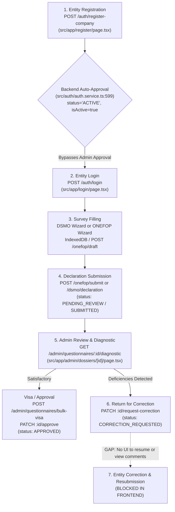
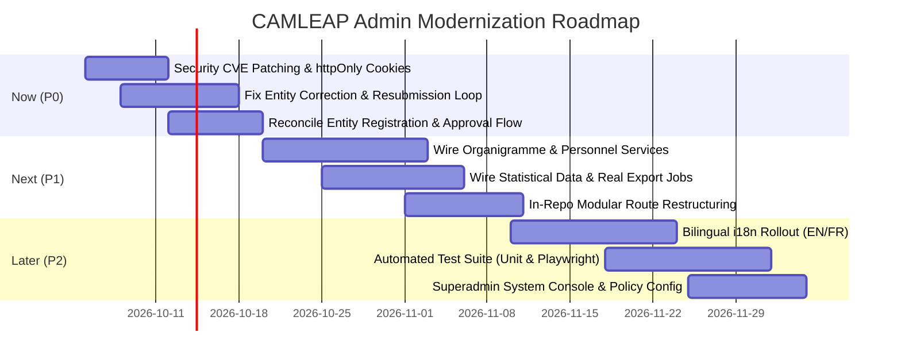

# CAMLEAP React Frontend Admin Audit Report

## Executive Summary

- **Audit Subject:** CAMLEAP React Web Frontend (`react-web`), operating alongside the NestJS/PostgreSQL/Prisma backend (`src/`).
- **Audit Date:** 2026-10-01 | **Status:** READ-ONLY Codebase Audit | **Evidence Standards:** Every finding is labeled as **[CONFIRMED]** (directly observed in source code with file paths) or **[INFERRED]** (logically deduced where explicit code does not exist).
- **Architecture Overview:** The frontend is a Next.js 16.3.5 App Router application (`src/app`) built with React 19.2.8, TypeScript 5, Tailwind CSS 4, TanStack Query v5, Zustand v5, and custom CSS design tokens (`src/app/tokens.css`, `admin-console.css`).
- **Core Findings:**
  1. **Dual Stream Architecture:** The application houses two parallel declaration streams: DSMO (3-tier division/region/national approval) and ONEFOP (single-tier territorial visa with 3-axis quality diagnostic).
  2. **Entity Approval Disconnect:** While admin approval screens exist (`src/app/admin/inscriptions/page.tsx`, `src/app/admin/etablissement-detail/approbation/page.tsx`), the backend automatically activates company registrations (`status: 'ACTIVE'`, `isActive: true` in `src/auth/auth.service.ts:599-600`) and explicitly throws an exception if an admin attempts to approve a `COMPANY` account (`src/auth/auth.service.ts:804-806`). Entity approval is therefore non-functional in the current flow.
  3. **Broken Correction Loop:** While an admin can return a dossier for correction with comments (`PATCH /admin/questionnaires/:id/request-correction` in `src/app/admin/dossiers/[id]/page.tsx`), the entity portal (`src/app/home/declarations/page.tsx:51,376`) groups `CORRECTION_REQUESTED` as "pending", hides the action button, does not display admin comments, and provides no interface to resume or resubmit the returned survey.
  4. **Unwired Backend Capabilities:** Substantial backend capabilities are implemented in NestJS controllers but completely unused in React: 20+ endpoints in `src/minefop-services/minefop-services.controller.ts` for organigramme/personnel hierarchy, user creation via `POST /auth/admin/create-minefop-user`, campaign progress tracking, and statistical reporting.
  5. **Security & Quality Risks:** Authentication tokens are stored in `localStorage`/`sessionStorage` rather than `httpOnly` cookies (`src/lib/api-client.ts:25-38`); Next.js middleware is absent; `npm audit` flags a Critical CVE in `next` (16.3.5) and a High CVE in `brace-expansion`; only a single unit test file exists across the entire frontend; and internationalization is almost entirely hardcoded French across admin pages despite Cameroon's bilingual constitution.
  6. **Recommendation:** An **in-repo modular restructuring** using Next.js route groups (`(review)`, `(central)`, `(system)`) sharing design tokens, authentication, and core API clients, rather than a fragmented multi-repo architecture.

---

## Phase 1 — Map the App

### 1.1 Technical Stack & Infrastructure
- **Framework & Routing:** Next.js 16.3.5 (`package.json:17`) utilizing the App Router (`src/app/`). Gated with layout guards (`src/lib/use-admin-screen-guard.ts`).
- **React Runtime:** React 19.2.8 & React-DOM 19.2.8 (`package.json:19-20`).
- **Language & Type System:** TypeScript 5.9.3 (`package.json:33`, `tsconfig.json`).
- **Build Tooling:** Next.js CLI / Webpack-Turbopack (`package.json:6-8`), PostCSS with `@tailwindcss/postcss` 4.0 (`package.json:24,32`), ESBuild 0.28.2 (`package.json:28`).
- **State Management:**
  - Client session / auth store: Zustand 5.0.15 (`src/lib/auth-store.ts`, `package.json:21`).
  - Server state / caching: `@tanstack/react-query` 5.102.8 (`src/app/query-provider.tsx`, `package.json:15`).
  - Offline / local drafts: Dexie 4.4.6 IndexedDB wrapper (`src/lib/onefop-drafts.ts`, `package.json:16`).
- **Data Fetching:** Native `fetch` wrapped in a custom client with Bearer JWT injection and structured error handling (`src/lib/api-client.ts:102-130`).
- **UI Library & Styling:** No third-party UI framework (no MUI, Radix, or Shadcn). Built with custom CSS token architecture: `src/app/tokens.css` (semantic variables), `src/app/globals.css`, and `src/app/admin-console.css` (54 KB layout/table rules).
- **Internationalization:** `next-intl` 4.14.4 (`package.json:18`, `src/i18n/config.ts`, `src/i18n/request.ts`). Cookie-backed locale (`NEXT_LOCALE`), message catalogs in `messages/fr.json` (56 KB) and `messages/en.json` (51 KB).
- **Folder Structure:**
  - `src/app/admin/`: Admin console pages, route definitions, layout, styling.
  - `src/app/home/`: Entity portal (declarations list, new declaration launcher, directory).
  - `src/app/(auth)/`: Login, registration, password recovery, email verification routes.
  - `src/app/onefop/preview/`: Modern Jobs canonical declaration wizard preview shell.
  - `src/components/admin/`: Admin UI components (sidebar, header, directory tables, dialogs, forms).
  - `src/components/modern-jobs/`: Questionnaire AST conditional logic, split-pane layout, geography selectors.
  - `src/components/onefop/`: Form renderers, guided statistical entry tables, legal acknowledgment, coherence rules.
  - `src/lib/`: API clients, stores, schemas, validation formulas, constants, user definitions.

### 1.2 Full User Journey Trace



1. **Registration:**
   - **[CONFIRMED]** The user visits `/register` (`src/app/register/page.tsx`). The 4-step wizard collects respondent identity, establishment details, entity type, geographic location, and tax/registration numbers. Calls `POST /auth/register-company` via `registerCompany()` (`src/lib/api-client.ts:288`).
2. **Approval:**
   - **[CONFIRMED]** In the intended domain workflow, admins review and approve entities.
   - **[CONFIRMED]** In actual code, `registerCompany()` in `src/auth/auth.service.ts:599-600` creates `COMPANY` accounts with `status: 'ACTIVE'` and `isActive: true`.
   - **[CONFIRMED]** If an admin attempts to call `approveUser()` on a `COMPANY` account, `src/auth/auth.service.ts:804-806` throws `BadRequestException('Les entreprises sont automatiquement approuvées')`.
   - **[CONFIRMED]** Admin approval pages (`src/app/admin/inscriptions/page.tsx`, `src/app/admin/etablissement-detail/approbation/page.tsx`) render disabled decision controls with notice *"Ce compte n'est pas en attente d'approbation"* (`docs/admin-replacement/ui-wiring-todo.md:67`).
3. **Login:**
   - **[CONFIRMED]** User authenticates at `/login` (`src/app/login/page.tsx`) calling `POST /auth/login` (`src/lib/api-client.ts:141`). Supports 2FA challenge via `POST /auth/2fa/verify` (`src/lib/api-client.ts:149`).
   - **[CONFIRMED]** Upon authentication, `src/app/login/page.tsx:47-66` inspects `user.role`. Administrative roles (`SUPER_ADMIN*`, `CENTRAL`, `REGIONAL`, `DIVISIONAL`, `DATA_MANAGER`, etc.) are redirected to `/admin/pilotage`; `COMPANY` users are redirected to `/home`.
4. **Survey Filling:**
   - **[CONFIRMED]** For DSMO declarations: `/home/declarations/new` (`src/app/home/declarations/new/page.tsx`) runs a multi-step form with draft autosaving to `POST /dsmo/declaration/draft` (`src/lib/api-client.ts:438`).
   - **[CONFIRMED]** For ONEFOP surveys: Launched via `NewDeclarationDialog.tsx` into `ModernJobsWizard.tsx` (`src/components/onefop/ModernJobsWizard.tsx`) / `/onefop/preview`. Uses offline IndexedDB caching (`src/lib/onefop-drafts.ts`) and remote sync `POST /onefop/draft` (`src/lib/onefop-submission.ts:72`). Supports Preliminary Declaration Quiz semantics (`QuizSemantics.ts`) to configure gateway branches.
5. **Submission / Declaration:**
   - **[CONFIRMED]** ONEFOP submissions call `POST /onefop/submit` (`src/lib/onefop-submission.ts:188`) with payload containing respondent metadata, entity details, quiz answers, table metrics, and legal acknowledgment signature (`OnefopLegalAcknowledgment.tsx`). Submission state becomes `PENDING_REVIEW`.
   - **[CONFIRMED]** DSMO submissions call `POST /dsmo/declaration` (`src/lib/api-client.ts:430`). Initial submission state is `SUBMITTED`.
6. **Correction:**
   - **[CONFIRMED]** An admin inspects the dossier at `/admin/dossiers/[id]` (`src/app/admin/dossiers/[id]/page.tsx`). If anomalies exist, the admin clicks *"Renvoyer pour correction"*, enters comments, checks certification, and triggers `requestCorrectionDossier()` (`PATCH /admin/questionnaires/:id/request-correction`, `src/lib/api-client.ts:585`). Dossier status updates to `CORRECTION_REQUESTED`.
7. **Resubmission (Broken Loop):**
   - **[CONFIRMED]** On the entity side (`src/app/home/declarations/page.tsx:51`), `CORRECTION_REQUESTED` is mapped to the `"pending"` group.
   - **[CONFIRMED]** `src/app/home/declarations/page.tsx:376` only renders the `onContinue` action button for entries where `group === "draft"`. For `"pending"` items, only a PDF download button is rendered.
   - **[CONFIRMED]** No admin comments are displayed anywhere in the entity declarations UI.
   - **[CONFIRMED]** Neither `src/app/home/declarations/new/page.tsx` nor `src/app/onefop/preview/page.tsx` accepts a submission ID parameter to load and correct a rejected survey. The correction loop is severed.

---

## Phase 2 — Endpoint Inventory

### 2.1 Table of Frontend API Calls
*(Note: Company analytics and observatory analytics endpoints are strictly excluded per audit rules).*

| Method | Path | Frontend File / Component | Purpose | Auth Required | Roles Allowed (Frontend/Backend) | Request Shape | Response Shape |
|---|---|---|---|---|---|---|---|
| `POST` | `/auth/login` | `src/lib/api-client.ts` | Authenticate user credentials | No | Public | `{ email, password }` | `{ access_token, user }` or `{ requiresTwoFactor, challengeToken }` |
| `POST` | `/auth/2fa/verify` | `src/lib/api-client.ts` | Verify 2FA TOTP code | No | Public | `{ challengeToken, code }` | `{ access_token, user }` |
| `GET` | `/auth/me` | `src/lib/api-client.ts` | Restore authenticated session | Yes (Bearer) | Any authenticated | None | `User` object |
| `POST` | `/auth/reset/questions` | `src/lib/api-client.ts` | Fetch security questions | No | Public | `{ login }` | `{ questions: Array<{key, question}> }` |
| `POST` | `/auth/reset/verify` | `src/lib/api-client.ts` | Submit security answers & new password | No | Public | `{ login, answers, newPassword }` | `{ message: string }` |
| `POST` | `/auth/reset-password` | `src/lib/api-client.ts` | Reset password with token | No | Public | `{ token, newPassword }` | `{ message: string }` |
| `POST` | `/auth/verify-email` | `src/lib/api-client.ts` | Verify account email token | No | Public | `{ token }` | `{ message: string }` |
| `POST` | `/auth/resend-verification` | `src/lib/api-client.ts` | Resend verification email | Yes (Bearer) | Authenticated | None | `{ message: string }` |
| `GET` | `/auth/check-email` | `src/lib/api-client.ts` | Check email registration availability | No | Public | Query: `?email=...` | `{ available: boolean }` |
| `POST` | `/auth/register-company` | `src/lib/api-client.ts` | Register new entity & account | No | Public | `RegisterCompanyPayload` | `RegisterCompanyResult` |
| `POST` | `/auth/identifier/find` | `src/lib/api-client.ts` | Recover forgotten establishment ID | No | Public | `{ companyName, taxNumber, phone }` | `{ establishmentId, matricule }` |
| `GET` | `/sectors` | `src/lib/api-client.ts` | Retrieve economic sectors directory | No (Backend) | Gated to staff in UI | None | `Sector[]` |
| `GET` | `/locations/regions` | `src/lib/api-client.ts` | Retrieve Cameroon regions | No | Public | None | `Region[]` |
| `GET` | `/locations/regions/:id/departments` | `src/lib/api-client.ts` | Retrieve departments for region | No | Public | Param: `:id` | `Department[]` |
| `GET` | `/locations/departments/:id/subdivisions` | `src/lib/api-client.ts` | Retrieve subdivisions for department | No | Public | Param: `:id` | `Subdivision[]` |
| `GET` | `/dsmo/company` | `src/lib/api-client.ts` | Get company profile of current user | Yes (Bearer) | COMPANY | None | `CompanyProfile` |
| `POST` | `/dsmo/company` | `src/lib/api-client.ts` | Create/update company profile | Yes (Bearer) | COMPANY | `SaveCompanyProfilePayload` | `CompanyProfile` |
| `GET` | `/dsmo/declarations` | `src/lib/api-client.ts` | List user's DSMO declarations | Yes (Bearer) | COMPANY | None | `DsmoDeclaration[]` |
| `POST` | `/dsmo/declaration` | `src/lib/api-client.ts` | Submit DSMO annual declaration | Yes (Bearer) | COMPANY | `DsmoDeclarationPayload` | `DsmoDeclaration` |
| `POST` | `/dsmo/declaration/draft` | `src/lib/api-client.ts` | Save DSMO declaration draft | Yes (Bearer) | COMPANY | `{ year, draftData }` | `{ success: boolean }` |
| `GET` | `/dsmo/declaration/draft` | `src/lib/api-client.ts` | Fetch current DSMO draft | Yes (Bearer) | COMPANY | None | `{ year, draftData }` |
| `DELETE`| `/dsmo/declaration/draft` | `src/lib/api-client.ts` | Clear DSMO declaration draft | Yes (Bearer) | COMPANY | None | `{ success: boolean }` |
| `GET` | `/onefop/submissions` | `src/lib/api-client.ts` | List user's ONEFOP submissions | Yes (Bearer) | COMPANY | None | `OnefopSubmission[]` |
| `GET` | `/onefop/active-quarter` | `src/lib/onefop-submission.ts` | Retrieve open quarter for survey | Yes (Bearer) | COMPANY | None | `{ quarterCode, label, year }` |
| `POST` | `/onefop/draft` | `src/lib/onefop-submission.ts` | Save ONEFOP survey draft | Yes (Bearer) | COMPANY | `{ entityType, quarterCode, draftData }` | `{ id: string }` |
| `POST` | `/onefop/submit` | `src/lib/onefop-submission.ts` | Final submission of ONEFOP survey | Yes (Bearer) | COMPANY | Canonical JSON submission payload | `{ success: boolean, submissionId }` |
| `GET` | `/admin/questionnaires/pilotage/queues` | `src/lib/api-client.ts` | Fetch real-time queues & counts | Yes (Bearer) | `SUPER_ADMIN*`, `CENTRAL`, `REGIONAL`, `DIVISIONAL` | Territory scoped | `PilotageQueues` |
| `GET` | `/admin/questionnaires` | `src/lib/api-client.ts` | List submissions with filters & pagination | Yes (Bearer) | Same as above | Query: `status, formType, region, period, search, limit, offset` | `{ items: any[], total: number }` |
| `GET` | `/admin/questionnaires/:id` | `src/lib/api-client.ts` | Fetch single dossier details | Yes (Bearer) | Same as above | Param: `:id` | `AdminDossier` |
| `GET` | `/admin/questionnaires/:id/diagnostic`| `src/lib/api-client.ts` | Fetch 3-axis quality diagnostic | Yes (Bearer) | Same as above | Param: `:id` | `DossierDiagnostic` |
| `PATCH`| `/admin/questionnaires/:id/approve` | `src/lib/api-client.ts` | Approve single dossier | Yes (Bearer) | Same as above | Param: `:id` | Updated submission |
| `PATCH`| `/admin/questionnaires/:id/reject` | `src/lib/api-client.ts` | Reject single dossier with reason | Yes (Bearer) | Same as above | `{ reason, certified }` | Updated submission |
| `PATCH`| `/admin/questionnaires/:id/request-correction` | `src/lib/api-client.ts` | Return dossier for correction | Yes (Bearer) | Same as above | `{ comments, certified }` | Updated submission |
| `POST` | `/admin/questionnaires/bulk-visa` | `src/lib/api-client.ts` | Bulk approve eligible dossiers | Yes (Bearer) | Same as above | `{ submissionIds, certified, notes }` | Bulk processing summary |
| `POST` | `/admin/questionnaires/bulk-reject`| `src/lib/api-client.ts` | Bulk reject dossiers | Yes (Bearer) | Same as above | `{ submissionIds, certified, reason }` | Bulk reject summary |
| `GET` | `/admin/questionnaires/anomalies/registry` | `src/lib/api-client.ts` | List anomalies across dossiers | Yes (Bearer) | Same as above | Query: `status, isBlocking, limit, offset` | `{ total: number, items: any[] }` |
| `PATCH`| `/admin/questionnaires/anomalies/:id/resolve` | `src/lib/api-client.ts` | Resolve data quality anomaly | Yes (Bearer) | Same as above | `{ resolutionType, resolutionNote, evidenceUrl }` | Updated anomaly record |
| `GET` | `/admin/questionnaires/export` | `src/app/admin/dossiers/page.tsx` | Stream filtered dossier list CSV/Excel | Yes (Bearer) | Same as above | Query: `format, status, region, formType, period` | Binary stream (`.csv`/`.xlsx`) |
| `GET` | `/campaigns` | `src/lib/campaigns.ts` | List all statistical campaigns | Yes (Bearer) | `SUPER_ADMIN*`, `CENTRAL`, `REGIONAL` | Query: `?status=...` | `Campaign[]` |
| `GET` | `/campaigns/:id` | `src/lib/campaigns.ts` | Fetch single campaign detail | Yes (Bearer) | Same as above | Param: `:id` | `CampaignDetail` |
| `POST` | `/campaigns/:id/activate` | `src/lib/campaigns.ts` | Activate campaign round | Yes (Bearer) | `SUPER_ADMIN*`, `CENTRAL` | Param: `:id` | `Campaign` |
| `POST` | `/campaigns/:id/pause` | `src/lib/campaigns.ts` | Pause active campaign | Yes (Bearer) | Same as above | Param: `:id` | `Campaign` |
| `POST` | `/campaigns/:id/close` | `src/lib/campaigns.ts` | Close campaign | Yes (Bearer) | Same as above | Param: `:id` | `Campaign` |
| `POST` | `/campaigns/:id/remind` | `src/lib/campaigns.ts` | Send reminder notification | Yes (Bearer) | Same as above | `{ type }` | `{ success: boolean }` |
| `POST` | `/campaigns/:id/extend` | `src/lib/campaigns.ts` | Extend campaign deadline | Yes (Bearer) | Same as above | `{ newDeadline }` | `Campaign` |
| `DELETE`| `/campaigns/:id` | `src/lib/campaigns.ts` | Delete campaign record | Yes (Bearer) | `SUPER_ADMIN*` | Param: `:id` | Deletion confirmation |
| `GET` | `/auth/users` | `src/lib/user-directory.ts` | Directory list of staff accounts | Yes (Bearer) | `SUPER_ADMIN`, `SUPER_ADMIN_ONEFOP` | Query: `roles, status, isActive, search, page, pageSize` | `ListUsersResult` |
| `PATCH`| `/auth/approve-user/:id` | `src/lib/user-directory.ts` | Approve pending staff account | Yes (Bearer) | Same as above | Param: `:id` | `User` |
| `PATCH`| `/auth/reject-user/:id` | `src/lib/user-directory.ts` | Reject staff account | Yes (Bearer) | Same as above | `{ reason? }` | `User` |
| `PATCH`| `/auth/users/:id/role` | `src/lib/user-directory.ts` | Update staff account role | Yes (Bearer) | Same as above | `{ role }` | `User` |
| `PATCH`| `/auth/users/:id/territory` | `src/lib/user-directory.ts` | Reassign agent role & territory | Yes (Bearer) | `SUPER_ADMIN` only | `{ role, region, department }` | `DirectoryUser` |
| `PATCH`| `/auth/users/:id/suspend` | `src/lib/user-directory.ts` | Suspend active account | Yes (Bearer) | `SUPER_ADMIN`, `SUPER_ADMIN_ONEFOP` | Param: `:id` | `User` |
| `PATCH`| `/auth/users/:id/activate` | `src/lib/user-directory.ts` | Reactivate suspended account | Yes (Bearer) | Same as above | Param: `:id` | `User` |
| `DELETE`| `/auth/users/:id` | `src/lib/user-directory.ts` | Hard-delete staff account | Yes (Bearer) | Same as above | Param: `:id` | `{ message: string }` |
| `GET` | `/dsmo/companies` | `src/lib/companies-directory.ts` | List registered entities | Yes (Bearer) | `SUPER_ADMIN*` | Query: `search, page, pageSize` | `ListCompaniesResult` |
| `POST` | `/data-management/export/submissions/excel` | `src/lib/api-client.ts` | Export statistical data to Excel | Yes (Bearer) | `SUPER_ADMIN*`, `CENTRAL`, `REGIONAL`, `DATA_MANAGER`, `ANALYST` | JSON filter criteria | Excel binary (`.xlsx`) |
| `POST` | `/data-management/export/submissions/spss/sav` | `src/lib/api-client.ts` | Export statistical data to SPSS SAV | Yes (Bearer) | Same as above | JSON filter criteria | SPSS binary (`.sav`) |
| `POST` | `/data-management/export/submissions/spss/manifest` | `src/lib/api-client.ts` | Export SPSS syntax file | Yes (Bearer) | Same as above | JSON filter criteria | `{ sps: string }` |
| `POST` | `/data-management/export/submissions/spss/csv` | `src/lib/api-client.ts` | Export SPSS raw CSV | Yes (Bearer) | Same as above | JSON filter criteria | CSV text blob |
| `GET` | `/audit/reports` | `src/lib/audit-log.ts` | List platform audit trail | Yes (Bearer) | `SUPER_ADMIN`, `SUPER_ADMIN_ONEFOP`, `AUDITOR` | Query: `period, actor, action, resourceType, resourceId, paginate, limit, offset` | `AuditLogPage` |
| `GET` | `/system-settings` | `src/lib/system-settings.ts` | Retrieve platform config | Yes (Bearer) | `SUPER_ADMIN` | None | `SystemSettings` |
| `PATCH`| `/system-settings` | `src/lib/system-settings.ts` | Update observatory identity | Yes (Bearer) | `SUPER_ADMIN` | `ObservatoryIdentityUpdate` | `SystemSettings` |
| `POST` | `/dsmo/notifications/send` | `src/lib/notifications.ts` | Broadcast email notification | Yes (Bearer) | `DIVISIONAL`, `REGIONAL`, `CENTRAL`, `SUPER_ADMIN*` | `{ subject, message, filters }` | `SendNotificationResult` |
| `PATCH`| `/dsmo/declarations/:id/validate` | `src/lib/declarations.ts` | DSMO declaration validation | Yes (Bearer) | `DIVISIONAL`, `REGIONAL`, `CENTRAL`, `SUPER_ADMIN*` | `{ accept, rejectionReason }` | `Declaration` |

### 2.2 Endpoints Partitioned by User Class
- **Entity Only (13 endpoints):** `/dsmo/company` (GET/POST), `/dsmo/declarations` (GET), `/dsmo/declaration` (POST), `/dsmo/declaration/draft` (GET/POST/DELETE), `/onefop/submissions` (GET), `/onefop/active-quarter` (GET), `/onefop/draft` (POST), `/onefop/submit` (POST), `/auth/resend-verification` (POST).
- **Admin Only (34 endpoints):** `/admin/questionnaires/*` (pilotage queues, listing, detail, diagnostic, approve, reject, request-correction, bulk-visa, bulk-reject, anomalies registry, resolve anomaly, export), `/campaigns/*` (listing, detail, activate, pause, close, remind, extend, delete), `/auth/users/*` (list, approve, reject, role, territory, suspend, activate, delete), `/dsmo/companies` (GET), `/data-management/export/*` (excel, spss sav, spss manifest, spss csv), `/audit/reports` (GET), `/system-settings` (GET/PATCH), `/dsmo/notifications/send` (POST), `/dsmo/declarations/:id/validate` (PATCH).
- **Both / Shared (9 endpoints):** `/auth/login`, `/auth/2fa/verify`, `/auth/me`, `/auth/reset/*` (questions, verify, token), `/auth/verify-email`, `/auth/check-email`, `/sectors`, `/locations/*`.

### 2.3 Unused Backend Endpoints (Exposed in NestJS, Not Called by Admin UI)
1. **MINEFOP Services / Organigramme Hierarchy:** Entire `src/minefop-services/minefop-services.controller.ts` (20+ endpoints: `GET /minefop-services`, `GET /minefop-services/tree`, `GET /minefop-services/roots`, `GET /minefop-services/children`, `GET /minefop-services/stats/summary`, `POST /minefop-services/positions`, `PATCH /minefop-services/positions/:id`, etc.). **[CONFIRMED]**
2. **Staff Creation:** `POST /auth/admin/create-minefop-user` (`src/auth/auth.controller.ts:105`). The UI has a disabled button *"Ajouter Agent"* on `/admin/utilisateurs`. **[CONFIRMED]**
3. **Legacy Minefop Pending Queue:** `GET /auth/pending-minefop` (`src/auth/auth.controller.ts:114`). **[CONFIRMED]**
4. **Agent Break-Glass 2FA Reset:** `PATCH /auth/users/:id/two-factor` (`src/auth/auth.controller.ts:175`). **[CONFIRMED]**
5. **Statistical KPI Engine:** `GET /data-management/stats` (`src/data-management/data-management.controller.ts:55`). Unused by `/admin/diffusion`, where KPI counts are hardcoded to "—". **[CONFIRMED]**
6. **Campaign Progress & Submissions Detail:** `GET /campaigns/:id/progress`, `GET /campaigns/:id/submissions`, `GET /campaigns/conflicts` (`src/campaign/campaign.controller.ts:50,56,44`). **[CONFIRMED]**
7. **Territory Mutation Endpoints:** `PATCH /data-management/regions/:id`, `DELETE /data-management/regions/:id`, `PATCH /data-management/sectors/:id`, `DELETE /data-management/sectors/:id` (`src/data-management/data-management.controller.ts:25-45`). **[CONFIRMED]**
8. **Scheduled Report & Batch Execution:** Entire `src/report/report.controller.ts` (`POST /report/schedule`, `GET /report/scheduled`, `GET /report/batch-jobs`, `POST /report/batch`, `POST /report/approve`). **[CONFIRMED]**
9. **Legacy Questionnaire Status Listings:** `GET /admin/questionnaires/pending`, `GET /admin/questionnaires/correction-requested` (`src/questionnaires/admin-questionnaires.controller.ts:158,167`). **[CONFIRMED]**

### 2.4 Repository Backend vs. Frontend Comparison
- **[CONFIRMED]** No OpenAPI/Swagger specification file exists in the repository.
- **[CONFIRMED]** Backend NestJS controllers located at `src/` (`..\src` relative to `react-web`) provide the authoritative API definition.
- **[CONFIRMED]** The frontend API client implementation (`src/lib/api-client.ts`, `src/lib/campaigns.ts`, `src/lib/user-directory.ts`) matches backend route signatures accurately, but covers only ~60% of available backend administrative capabilities.

---

## Phase 3 — Current Admin App

### 3.1 Navigation Structure & Routes

```
Admin Console (Layout Guard: ADMIN_ROLES)
│
├── SUPERVISION
│   ├── Tableau de bord              --> /admin/pilotage (KpiTiles, Pipeline, Region Coverage, Recent Activity)
│   ├── Dossiers en instance         --> /admin/files-attente (Anomalies registry, Visas & Corrections tabs)
│   └── Activité & alertes           --> [Unimplemented: href null]
│
├── COLLECTE
│   ├── Campagnes                    --> /admin/campagnes (Campaigns lifecycle table, pause, close, remind)
│   └── Questionnaires               --> /admin/questionnaires (AST & Schema viewer shell, not in sidebar)
│
├── DÉCLARANTS
│   ├── Inscriptions                 --> /admin/inscriptions (Registration review queue shell, not in sidebar)
│   ├── Établissements               --> /home/annuaire (Annuaire table of registered establishments)
│   ├── Détail Établissement         --> /admin/etablissement-detail?id=... (Profile, account actions, audit)
│   │   └── Validation du compte     --> /admin/etablissement-detail/approbation?id=... (Account approval shell)
│   └── Utilisateurs                 --> [Unimplemented: href null]
│
├── CONTRÔLE QUALITÉ
│   ├── Centre de contrôle qualité   --> /admin/centre-qualite (Anomalies breakdown shell, not in sidebar)
│   ├── Contrôle régional            --> [Unimplemented: href null]
│   ├── Contrôle national            --> [Unimplemented: href null]
│   ├── Anomalies                    --> [Unimplemented: href null]
│   └── Visas & décisions            --> /admin/dossiers (Dossier review list, bulk visa modal, export)
│       └── Fiche Dossier            --> /admin/dossiers/[id] (3-Axis diagnostic, anomaly resolve, reject/correction dialogs)
│
├── DONNÉES
│   ├── Jeux de données              --> [Unimplemented: href null]
│   ├── Qualité                      --> [Unimplemented: href null]
│   └── Exports                      --> /admin/diffusion (SPSS .sav, SPSS .sps, Excel .xlsx export builder)
│
└── ADMINISTRATION
    ├── Utilisateurs ONEFOP          --> /admin/utilisateurs (Agent roster, approval, role change, suspend, delete)
    ├── Rôles & permissions          --> [Unimplemented: href null]
    ├── Journal d'audit              --> /admin/journal-audit (Systemic audit log, filters, pagination)
    ├── Paramètres                   --> /admin/parametres (Observatory identity, security reference tabs)
    └── Secteurs                     --> /admin/sectors (National sectors nomenclature, not in sidebar)
```

### 3.2 Role & Scope Handling (Territory Enforcement)
- **UI Enactment:**
  - `src/app/admin/layout.tsx:36-52`: Restricts layout to 10 administrative roles via `useAdminScreenGuard`.
  - `src/app/admin/_routes.ts:16-95`: Maps route prefixes to `allowedRoles` (derived from backend `@Roles`).
  - `src/components/admin/RequireAdminRole.tsx`: Gates individual admin views; renders an "Accès restreint" message if unauthorized.
  - `src/components/admin/AdminSidebar.tsx:55`: Filters sidebar navigation items based on the user's role.
- **Backend API Enactment (Confirmed Strict):**
  - **[CONFIRMED]** Enforcement is **not** UI-only. The backend controller methods apply `@UseGuards(JwtAuthGuard, RolesGuard)` and `@Roles(...)`.
  - **[CONFIRMED]** Geographic scoping is enforced at the database query level via `territoryFromUser(req.user)` and `territoryWhere(territory)` (`src/auth/territory.ts:79-100`).
  - `CENTRAL`, `SUPER_ADMIN`, `SUPER_ADMIN_ONEFOP` have national jurisdiction (`NATIONAL_ROLES`).
  - `REGIONAL` queries are automatically scoped by `user.region`.
  - `DIVISIONAL` queries are automatically scoped by both `user.region` AND `user.department`.
  - An agent without an assigned territory fails closed (matches 0 rows, `src/auth/territory.ts:34`).
  - Mutations check `assertTerritorialAuthority(actor, target)` (`src/auth/staff-scope.ts:25`).
  - National statistical exports grant read scope to `SUPER_ADMIN_DSMO`, `DATA_MANAGER`, and `ANALYST` via `territoryWhereForExport()` (`src/auth/territory.ts:88-90`).

### 3.3 Status of Core Capabilities

| Capability | Status | Implementation Details & Evidence |
|---|---|---|
| **Account Approval (Entities)** | **Partial / Broken** | UI exists at `/admin/inscriptions` and `/admin/etablissement-detail/approbation`. Backend automatically activates company registrations (`status: 'ACTIVE'`, `src/auth/auth.service.ts:599`) and explicitly forbids approval (`src/auth/auth.service.ts:804`). |
| **Account Approval (Personnel)** | **Present** | Functional in `/admin/utilisateurs` (`UsersDirectory.tsx:61`) calling `PATCH /auth/approve-user/:id`. Scoped to MINEFOP staff. |
| **Survey Review** | **Present** | Implemented at `/admin/dossiers` (`src/app/admin/dossiers/page.tsx`) with server-side filters, and `/admin/dossiers/[id]` (`src/app/admin/dossiers/[id]/page.tsx`) displaying 3-axis quality diagnostic. |
| **Send for Correction with Comments** | **Partial** | Admin side is **Present** (`/admin/dossiers/[id]`, `src/lib/api-client.ts:585`). Entity side is **Missing / Broken** (`src/app/home/declarations/page.tsx:51,376`); entity cannot see comments or resubmit. |
| **Entity Management** | **Partial** | Directory view present at `/home/annuaire` (`CompaniesDirectory.tsx`). Detail view at `/admin/etablissement-detail`. Missing: admin editing, password reset (throws 400), entity submission history. |
| **Personnel Management** | **Partial** | Account actions (suspend, role change, delete) present in `/admin/utilisateurs`. Missing: agent creation (disabled button), territory reassignment (unwired), organigramme (`minefop-services` unused). |
| **Registration / Survey Snapshot** | **Partial** | Survey snapshot is **Present** (`/admin/pilotage`, `getPilotageQueues` returns counts by status and region). Registration snapshot is **Missing** (`inscriptionsPending` is hardcoded `null`). |
| **Excel Export** | **Present** | Dossiers list export (`GET /admin/questionnaires/export?format=xlsx`) and statistical dataset export (`POST /data-management/export/submissions/excel`). |
| **SPSS Export** | **Present / Partial** | SPSS SAV binary (`.sav`) and Syntax (`.sps`) exports present in `/admin/diffusion`. Codebook downloads and export history table are unwired/mocked. |
| **Admin Management** | **Partial** | Superadmin can modify existing staff accounts in `/admin/utilisateurs`. No dedicated superadmin management portal or admin creation UI. |
| **System Configuration** | **Partial** | Observatory identity editable via `PATCH /system-settings` (`src/app/admin/parametres/page.tsx`). Security policies, thresholds, and maintenance toggles are static read-only text. |
| **Audit Logs** | **Present** | Dedicated viewer at `/admin/journal-audit` (`src/lib/audit-log.ts:39`) with filters (actor, action, period, resource) and pagination. Lacks export capability. |
| **Notifications** | **Partial** | Backend broadcasting exists (`POST /dsmo/notifications/send`). Component `SendNotificationForm.tsx` exists. No dedicated admin route in sidebar ("Activité & alertes" is `href: null`). |

### 3.4 Workflow States & Systemic Inconsistencies
1. **DSMO vs. ONEFOP Approval Hierarchy:**
   - **[CONFIRMED]** DSMO declarations utilize a 4-tier status progression: `DRAFT` -> `SUBMITTED` -> `DIVISION_APPROVED` -> `REGION_APPROVED` -> `FINAL_APPROVED` (or `REJECTED`).
   - **[CONFIRMED]** ONEFOP submissions utilize a flat status progression: `DRAFT` -> `PENDING_REVIEW` -> `APPROVED` (or `CORRECTION_REQUESTED`, `REJECTED`). Any admin with jurisdiction (Divisional, Regional, or Central) who approves a ONEFOP dossier sets it directly to `APPROVED`. There are no divisional or regional intermediate visa states in ONEFOP.
2. **Registration vs. Activation Disconnect:**
   - **[CONFIRMED]** The domain specifications describe an approval gate for registering entities. In practice, `registerCompany()` activates accounts immediately (`src/auth/auth.service.ts:599`), rendering the registration approval queue in the admin console completely empty in normal operation.
3. **Audit Row Omissions:**
   - **[CONFIRMED]** Single-dossier approval (`PATCH /admin/questionnaires/:id/approve`) writes no `AuditLog` entry, whereas bulk-visa writes `AUDIT_BULK_VISA_GRANTED` (`src/questionnaires/eligibility-engine.service.ts`).
   - **[CONFIRMED]** Dissemination downloads on `/admin/diffusion` write no audit rows (`docs/admin-replacement/role-decisions.md:93`).

---

## Phase 4 — Quality Review

### 4.1 Strengths (Worth Retaining)
- **Robust Diagnostic Engine:** The 3-axis diagnostic architecture (Axis 1: Administrative Visa, Axis 2: Data Quality & Anomalies, Axis 3: Statistical Eligibility) provides rock-solid data integrity guarantees before export (`src/questionnaires/eligibility-engine.service.ts`).
- **Granular Server-Side Scoping:** Administrative boundaries (`src/auth/territory.ts`) are enforced at the query level in Prisma, preventing accidental data leakage across regions or departments.
- **Design Token Discipline:** Visual styling is organized around a consistent palette of CSS custom properties (`src/app/tokens.css`, `admin-console.css`), providing a solid aesthetic foundation.
- **Zero Raw HTML Injection:** Clean code without any `dangerouslySetInnerHTML` instances, preventing straightforward DOM-based XSS.

### 4.2 Limits & Technical Debt
- **Duplication & Parallel Modules:** `src/components/admin/DeclarationsList.tsx` and `src/app/admin/dossiers/page.tsx` duplicate declaration table logic. Multiple directory components (`UsersDirectory.tsx`, `CompaniesDirectory.tsx`) duplicate search, debouncing, and pagination mechanics.
- **Tight Coupling to Canonical AST:** Form structures and question logic depend heavily on external Dart AST definitions (`onefop_ast.dart`) compiled into JSON, limiting frontend dynamism.
- **Missing Pagination & Scalability Gaps:** The anomalies registry on `/admin/files-attente` loads with unpaginated defaults (`limit=100`); large campaigns will lead to client-side sluggishness.
- **Hardcoded Forms & Localization Void:**
  - **[CONFIRMED]** Almost all admin pages (`/admin/dossiers`, `/admin/files-attente`, `/admin/campagnes`, `/admin/utilisateurs`, `/admin/parametres`, `/admin/diffusion`) contain 100% hardcoded French strings with zero `useTranslations()` integration.
  - Only `admin/layout.tsx` (loading text) and `admin/sectors/page.tsx` consume `next-intl`.
- **Accessibility Deficits (WCAG 2.1 AA):**
  - Table headers lack `scope="col"` attributes.
  - Multi-select checkboxes in dossier tables lack distinct `aria-label` tags referencing the specific entity name.
  - Color-only indicators for status without supplemental screen-reader text.
  - No skip-to-content links.
- **Dead Code & Unwired Elements:**
  - Multiple `href: null` sidebar items (`Activity & alertes`, `Questionnaires`, `Inscriptions`, `Contrôle régional`, `Contrôle national`, `Anomalies`, `Jeux de données`, `Qualité`, `Rôles & permissions`).
  - 12 formal TODO/FIXME items documented in `docs/pending-work.md` (e.g., CTD dossier search limitation, missing inscriptions count, unwired campaign targets).

### 4.3 Security Assessment
- **Token Storage Vulnerability:**
  - **[CONFIRMED]** Authentication tokens are stored in `localStorage` or `sessionStorage` under `camleap.access_token` (`src/lib/api-client.ts:25-38`). This leaves tokens susceptible to exfiltration via any script execution vulnerability.
  - *Mitigation recommendation:* Transition to `httpOnly`, `SameSite=Lax`, `Secure` cookies.
- **Route Guards & Middleware:**
  - **[CONFIRMED]** Route protection is client-side only (`useAdminScreenGuard` in React components). There is **no Next.js `middleware.ts`**. Unauthenticated requests load page bundles before redirecting.
- **Vulnerability Audit Findings (`npm audit`):**
  - **Critical:** `next` (installed: 16.3.5, vulnerable range: 16.2.0 - 16.3.5) — Remote Code Execution in `next/og ImageResponse` (GHSA-vcvr-r3jv-pc5j). Fix: update to Next.js 16.3.8+.
  - **High:** `brace-expansion` (<=1.1.20) — CPU Denial of Service via quadratic-time expansion / uncontrolled recursion (GHSA-q2hr-2g5m-vwhr, GHSA-qhr7-859c-m2p7, GHSA-6j4f-fj2g-mc7p).
- **Outdated Dependencies (`npm outdated`):**
  - `next`: 16.3.5 -> 16.3.8
  - `@tanstack/react-query`: 5.102.8 -> 5.104.0
  - `react` / `react-dom`: 19.2.8 -> 19.3.0
  - `eslint`: 9.39.5 -> 10.11.0
  - `next-intl`: 4.14.4 -> 4.14.8
- **Hardcoded Secrets:**
  - **[CONFIRMED]** No passwords, API keys, or JWT secrets are hardcoded in the codebase.
  - **[CONFIRMED]** Production fallback URL is hardcoded in `src/lib/api-client.ts:21` (`https://dsmo-app-2.onrender.com/api`).

### 4.4 Testing, Tooling & Environment
- **Test Coverage:**
  - **[CONFIRMED]** Only **1 unit test file** exists in the entire frontend: `src/components/modern-jobs/scope/QuizSemantics.test.ts`.
  - Zero tests exist for admin pages, layout guards, directory tables, or the API client.
  - Playwright is present in `package.json` (`playwright: ^1.56.0`), but no Playwright test scripts, specs, or configuration files exist.
- **Linting & Code Standards:** ESLint 9 is configured with `eslint-config-next` (`package.json:29-30`).
- **CI/CD:** No CI/CD workflow configuration (no `.github/workflows/`, GitLab CI, or deployment pipeline files) in `react-web`.
- **Environment Configuration:** No `.env` or `.env.example` in `react-web`. Relies on `process.env.NEXT_PUBLIC_API_URL` falling back to localhost or Render URL.

---

## Phase 5 — Development Plan

### 5.1 Gap Analysis Against Target Tri-App Structure

| Target Sub-Application | Target User Roles | Required Capabilities | Current Status in React Frontend | Key Gaps to Close |
|---|---|---|---|---|
| **1. Review & Validation App** | Divisional, Regional, Central Admins (`DIVISIONAL`, `REGIONAL`, `CENTRAL`) | Territorial dashboard, priority queues, dossier inspection, 3-axis quality diagnostic, anomaly resolution, bulk/single visas, return for correction with comments. | **70% Present** (`/admin/pilotage`, `/admin/files-attente`, `/admin/dossiers`, `/admin/dossiers/[id]`). | • Fix broken entity correction loop so returned surveys can be resubmitted.<br>• Clarify/reconcile single-tier ONEFOP approval vs. 3-tier DSMO approval.<br>• Implement paginated anomalies registry. |
| **2. Central Management App** | Central Admin, Data Managers, Campaign Managers (`CENTRAL`, `DATA_MANAGER`, `CAMPAIGN_MANAGER`) | MINEFOP organigramme & personnel hierarchy, accredited agent creation & reassignment, entity master directory, campaign creation/scheduling/lifecycle, statistical exports (Excel, SPSS), codebook distribution. | **35% Present** (`/admin/campagnes`, `/admin/diffusion`, `/admin/sectors`, `/home/annuaire`). | • Wire backend `minefop-services` (20+ endpoints) for organigramme & position management.<br>• Wire `POST /auth/admin/create-minefop-user` and reassignment.<br>• Wire `GET /data-management/stats` to replace mock data on `/admin/diffusion`.<br>• Add campaign creation UI. |
| **3. System Console** | Superadmin (`SUPER_ADMIN`, `SUPER_ADMIN_ONEFOP`, `SUPER_ADMIN_DSMO`) | Admin user management, privilege assignment, system security configuration (password policies, lockout rules, maintenance mode), systemic audit log search & export, platform telemetry. | **40% Present** (`/admin/utilisateurs`, `/admin/parametres`, `/admin/journal-audit`). | • Separate superadmin console from operational staff directory.<br>• Persist system & security settings to backend database.<br>• Add server-side self-audited audit log export.<br>• Break-glass 2FA recovery UI. |

### 5.2 Recommendation: Restructure vs. Extend
- **Recommendation:** **Modular In-Repo Restructuring (Extend via Next.js Route Groups)**.
- **Rationale:**
  1. Splitting into 3 separate standalone web applications would create severe code duplication across design tokens, authentication state, TanStack Query hooks, and shared TypeScript models.
  2. All three applications consume the exact same NestJS backend API and share authentication tokens and territorial permission primitives.
  3. Next.js App Router natively supports Route Groups (`(review)`, `(central)`, `(system)`). Each group can maintain its own layout, specialized sidebar navigation, and dedicated role guards while sharing root design tokens, i18n providers, and utility libraries.

### 5.3 Prioritized Roadmap



| Phase | Task | Effort | Dependencies | Risks | Required Backend Changes |
|---|---|---|---|---|---|
| **Now** | **Patch Critical CVEs & Outdated Packages** | **S** | None | Breaking Next.js API changes | None (upgrade `next` to 16.3.8+, `brace-expansion`). |
| **Now** | **Fix Entity Correction & Resubmission Loop** | **M** | None | Data schema mismatch between revisions | Ensure `GET /onefop/submissions/:id` returns draft JSON payload; allow re-posting to `/onefop/submit` with `previousSubmissionId`. |
| **Now** | **Reconcile Entity Registration & Approval Flow** | **M** | Domain decision | Disrupting live self-service registrations | Change `registerCompany` default user status to `PENDING_APPROVAL` (or clarify if registration approval is required); remove `COMPANY` exception in `approveUser`. |
| **Next** | **Wire Organigramme & Personnel Management** | **L** | Target App Split | Complex hierarchical UI state | Expose search/filter on existing `minefop-services` endpoints; ensure role authorization guards match UI expectations. |
| **Next** | **Real Statistical Exports & Dissemination KPIs** | **M** | Backend stats endpoint | Large dataset timeouts | Wire `GET /data-management/stats` to replace mock cards; create `export_jobs` table for persistent download history. |
| **Next** | **In-Repo Route Restructuring (Review / Central / System)** | **M** | Route alignment | Broken bookmarks/links | None (organize routes into Next.js Route Groups with dedicated layout sidebars). |
| **Later** | **Bilingual i18n Rollout (EN/FR)** | **L** | All UI strings | Untranslated technical jargon | None (extract strings into `messages/fr.json` and `messages/en.json`, bind `useTranslations`). |
| **Later** | **Comprehensive Test Suite (Unit + Playwright E2E)** | **L** | Route stability | Fragile CI selectors | Establish mock API test server or Dockerized backend fixture. |
| **Later** | **System Console & Security Policy Persistence** | **M** | Schema migration | Lockout misconfigurations | Add schema columns for lockout thresholds, password policy, and maintenance mode in `system-settings`. |

### 5.4 Open Questions for Stakeholders
1. **Entity Registration Approval vs. Auto-Activation:** Is it a firm policy requirement that business enterprises and vocational centres be manually validated by Divisional/Regional ONEFOP admins before they can log in, or is self-registration with automatic activation intentional for compliance intake?
2. **Approval Tier Architecture for ONEFOP:** Should ONEFOP surveys follow DSMO's 3-tier territorial escalation (`DIVISION_APPROVED` -> `REGION_APPROVED` -> `FINAL_APPROVED`), or should any divisional/regional admin visa remain final?
3. **Personnel Hierarchy (Organigramme):** Does the MINEFOP central admin need full CRUD management of organizational positions and departmental hierarchy in the React Web app, or is the existing backend service meant for internal synchronization only?
4. **Data Dissemination Scope:** Should Divisional and Regional administrators have access to statistical SPSS/Excel export tools, or must official statistical dissemination remain strictly restricted to Central Admins and National Data Managers?

---

## Excluded from Audit

Per user rules, all routes, pages, components, endpoints, state, and charts related to **Company Analytics** (`src/app/home/analytics/*`, `src/analytics/analytics.controller.ts`, `src/analytics/bilan.controller.ts`) and **Observatory Analytics** (`src/app/admin/analytics/*`, `src/analytics/onefop-analytics.controller.ts`) were strictly excluded from analysis, endpoint inventory, and planning.
